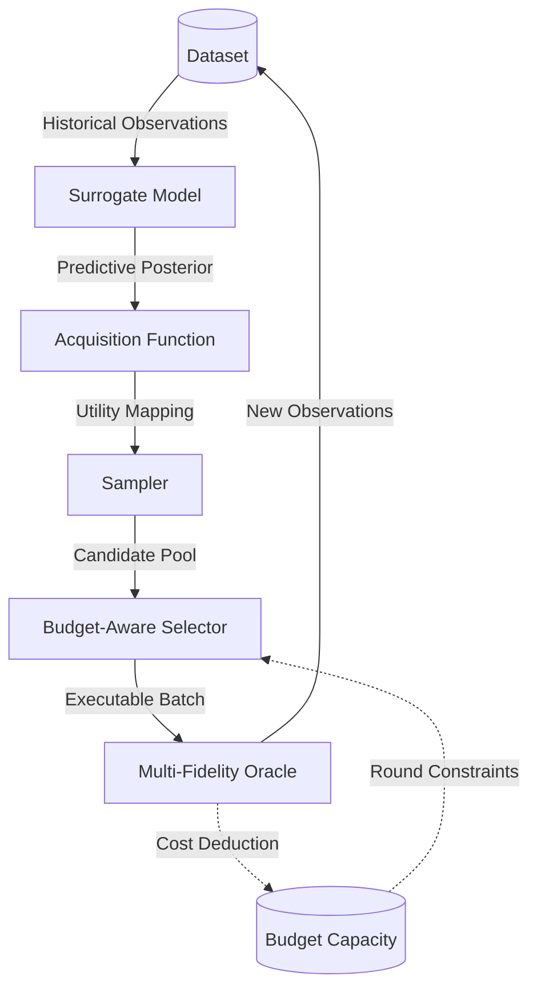

# Active Learning Execution Loop

The active learning execution loop iteratively manages budget constraints while interacting with the core components. Iteratively, it: (1) fits the surrogate on current data, (2) samples candidates, (3) selects candidates to label, and (4) queries the oracle and adds observations. The loop stops when the budget is exhausted or no affordable candidates remain.

The architectural sequence is formally defined as:

## Context Binding and Initialization

Prior to the loop, the system binds the shared `RuntimeContext` to all active learning components ([`Dataset`](../api/dataset.md#activelearning.dataset.dataset.Dataset), [`Surrogate`](../api/surrogate.md#activelearning.surrogate.surrogate.Surrogate), [`Acquisition`](../api/acquisition.md#activelearning.acquisition.acquisition.Acquisition), [`Sampler`](../api/sampler.md#activelearning.sampler.sampler.Sampler), [`Selector`](../api/selector.md#activelearning.selector.selector.Selector), [`Oracle`](../api/oracle.md#activelearning.oracle.oracle.Oracle), [`Budget`](../api/budget.md#activelearning.budget.budget.Budget)). It then propagates oracle fidelity confidences to the surrogate via [`set_fidelity_confidences()`](../api/surrogate.md#activelearning.surrogate.surrogate.Surrogate.set_fidelity_confidences) before the loop begins. Surrogates that do not use fidelity metadata can safely ignore this as a no-op default.

## Active Learning Loop (Per Round)

While [`budget.available_budget`](../api/budget.md#activelearning.budget.budget.Budget) > 0, the loop executes the following sequence:

### 1. Observation Retrieval
The system calls [`dataset.get_observations_iterable()`](../api/dataset.md#activelearning.dataset.dataset.Dataset.get_observations_iterable) once per round. This ensures all downstream consumers share the same consistent epoch view of the historical observations.

### 2. Surrogate Model Update
The framework dispatches the [surrogate](../api/surrogate.md#activelearning.surrogate.surrogate.Surrogate) update based on its declared strategy:

- If [`updates_from_latest()`](../api/surrogate.md#activelearning.surrogate.surrogate.Surrogate.updates_from_latest) is True, it performs an incremental update on new observations only via [`dataset.get_latest_observations_iterable()`](../api/dataset.md#activelearning.dataset.dataset.Dataset.get_latest_observations_iterable).
- If False, it executes a full refit via [`fit()`](../api/surrogate.md#activelearning.surrogate.surrogate.Surrogate.fit) using the shared observations iterable, guaranteeing it sees the same consistent data as the acquisition and sampler.

### 3. Acquisition Update
The system only couples the [acquisition function](../api/acquisition.md#activelearning.acquisition.acquisition.Acquisition) to the surrogate once [`surrogate.is_fitted()`](../api/surrogate.md#activelearning.surrogate.surrogate.Surrogate.is_fitted) evaluates to True. Before fitting, the acquisition falls back to its unfitted behaviour (e.g., returning zero scores), enabling random candidate selection on a cold start.

### 4. Candidate Sampling
The [sampler](../api/sampler.md#activelearning.sampler.sampler.Sampler) proposes candidate subsets, returning `samples`. It uses the [acquisition](../api/acquisition.md#activelearning.acquisition.acquisition.Acquisition) for scoring candidates and passes current `observations` to avoid re-sampling previously queried points. This generates the candidate pool.

### 5. Cost-Aware Selection
The framework retrieves the round budget via [`budget.get_round_budget()`](../api/budget.md#activelearning.budget.budget.Budget.get_round_budget). The [selector](../api/selector.md#activelearning.selector.selector.Selector) then evaluates the `samples` to choose final candidates, using the [acquisition](../api/acquisition.md#activelearning.acquisition.acquisition.Acquisition) and [`oracle.get_costs()`](../api/oracle.md#activelearning.oracle.oracle.Oracle.get_costs) as the cost function under the round budget constraint.

### 6. Budget Verification and Oracle Query
Before execution, the system queries the [oracle](../api/oracle.md#activelearning.oracle.oracle.Oracle) to obtain the total cost for the selected batch.

- It verifies affordability via [`budget.can_afford(total_cost)`](../api/budget.md#activelearning.budget.budget.Budget.can_afford).
- If affordable, it triggers [`budget.consume(total_cost)`](../api/budget.md#activelearning.budget.budget.Budget.consume) and retrieves `new_observations` via [`oracle.query()`](../api/oracle.md#activelearning.oracle.oracle.Oracle.query).

### 7. Dataset Update and Telemetry
The `new_observations` are committed via [`dataset.add_observations()`](../api/dataset.md#activelearning.dataset.dataset.Dataset.add_observations). If a logger exists in the runtime context, the loop records per-round metrics including `round`, `num_new_samples`, `round_cost`, `total_cost`, and `budget_remaining`.

## Early Termination Notes

To prevent infinite loops, the execution loop terminates early if:

- `not selected_samples` evaluates to True (no candidates selected for the round, avoiding stalling).
- [`budget.can_afford(total_cost)`](../api/budget.md#activelearning.budget.budget.Budget.can_afford) evaluates to False (budget exhausted).

## Breakdown of Modularity and Research Implications

Budget-constrained iterative selection is mandatory for diverse, high-scoring scientific discovery; static, one-shot experimental designs cannot adapt dynamically to acquired evidence. This strict modular decomposition permits targeted experimental ablation without modifying the underlying orchestration logic:

- Substitute the **[surrogate](../extension-guide/surrogate.md)** to test alternative probabilistic priors or inter-fidelity transfer mechanisms.
- Substitute the **[acquisition](../extension-guide/acquisition.md)** to bias the search toward exploitation vs. global exploration.
- Substitute the **[sampler](../extension-guide/sampler.md)** to evaluate generative proposal mechanisms (e.g., GFlowNets).
- Substitute the **[selector](../extension-guide/selector.md)** to evaluate greedy vs. lookahead budget allocation policies.
- Substitute the **[oracle](../extension-guide/oracle.md)** to transition from benchmark functions to real-world workflows.

For step-by-step instructions on implementing custom components, see the [Extension Guide](../extension-guide/index.md).

To explore the mathematical implications of the multi-fidelity parameterization, proceed to [Multi-Fidelity Active Learning](multi_fidelity.md).
