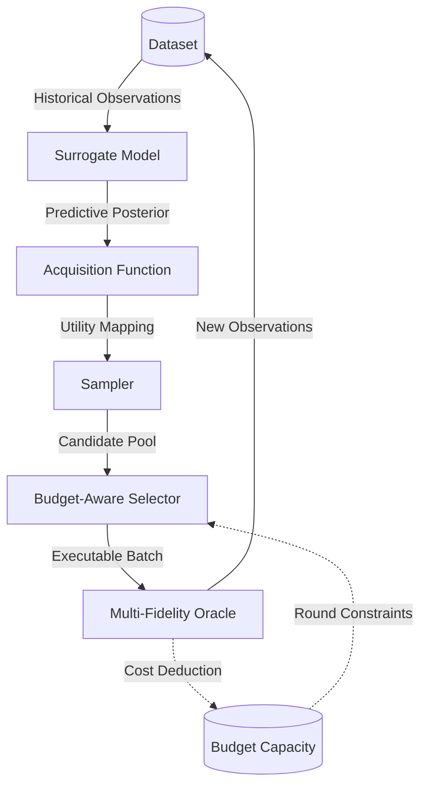

# **Active Learning Loop**

The active learning loop is the central orchestration mechanism. Each round, it fits the surrogate on everything observed so far, generates a pool of candidate queries, selects a budget-affordable subset, evaluates them through the oracle, and appends the results to the dataset. The loop stops when the budget is exhausted or no affordable candidates remain.

## **Initialisation**

Before the loop begins, a shared [`RuntimeContext`](../reference/activelearning/runtime/#activelearning.runtime.RuntimeContext) is constructed from the YAML config and bound to all components. This propagates the compute device, floating-point precision, and logger reference across the entire experiment — every component sees the same execution environment without any per-component wiring.

Oracle fidelity confidences are also forwarded to the surrogate at this point so it can incorporate fidelity-specific uncertainty scaling from the start.

## **Per-Round Sequence**

Each round of the loop performs the following steps in order.

### **1. Observation retrieval**

The loop takes a consistent snapshot of the dataset at the start of each round. All downstream components in that round share the same view of historical data.

### **2. Surrogate update**

The surrogate is refitted on the current observations. Depending on the surrogate's strategy, this may be a full refit from scratch or an incremental update on new data only.

!!! note "Cold start"
    For the first few rounds — before the dataset contains enough points to fit the surrogate reliably — the acquisition falls back to random scoring. This means the algorithm still makes useful queries even with an empty initial dataset.

### **3. Acquisition update**

Once the surrogate is fitted, the acquisition function is coupled to it and updated. This prepares the scoring function for the candidate pool generated in the next step.

### **4. Candidate sampling**

The sampler generates a pool of candidate-fidelity pairs $(x, m)$ to consider. Some samplers may use the acquisition signal and historical observations to shape this pool, while others may generate proposals independently. The size of this pool is controlled by `sampler.num_samples`.

### **5. Budget-aware selection**

The selector scores the candidate pool and picks the subset that fits within the current round budget. It jointly uses the acquisition scores and oracle cost estimates to maximise the value extracted per unit budget.

!!! tip "Round vs. total budget"
    The **round budget** (`budget.schedule.value`) caps how much can be spent in a single iteration. The **total budget** (`budget.available_budget`) is the global constraint. An optional `budget.max_rounds` caps the number of completed iterations. These limits are enforced independently — a round ends when its budget is hit, and the run ends when any global limit is reached.

### **6. Oracle query**

The selected batch is sent to the oracle, which evaluates the objective at the requested fidelities. The incurred cost is deducted from the budget. If the batch turns out to be unaffordable (e.g. due to rounding), the round is skipped to prevent overspending.

### **7. Dataset update and monitoring**

New observations are appended to the dataset, making them available to the next round. If a logger is configured, the loop records per-round metrics under the `active_learning/` namespace, including the round index, proposed and selected sample counts, observation counts, round and cumulative cost, and remaining budget.

Phase durations are recorded under `profiling/`, including surrogate fitting,
acquisition updates, sampler sampling, selection, oracle work, dataset
updates, diagnostics, and total round time. The outer loop commits these
values at the active-learning round. Logger backends receive live metrics and
figures at that step, while a configured run writer persists the same round
data for post-hoc analysis. GFlowNet and S3-GFN retain their native inner
training resolution in implementation-specific diagnostics without advancing
the active-learning round. See [Monitoring and Diagnostics](monitoring_and_diagnostics.md)
for the metric and artifact conventions.

## **Early Termination**

The loop exits early if:

- the candidate pool is empty (no proposals survived selection),
- the total budget is insufficient to afford any remaining batch,
- `budget.max_rounds` completed rounds.

## **Modularity and Extensibility**

This strict decomposition makes ablation studies and extensions straightforward:

- Swap the **[surrogate](../extension-guide/surrogate.md)** to test alternative probabilistic models or inter-fidelity transfer mechanisms.
- Swap the **[acquisition](../extension-guide/acquisition.md)** to change the exploration-exploitation trade-off.
- Swap the **[sampler](../extension-guide/sampler.md)** to compare generative proposal mechanisms such as GFlowNets against uniform sampling.
- Swap the **[selector](../extension-guide/selector.md)** to evaluate different budget allocation policies.
- Swap the **[oracle](../extension-guide/oracle.md)** to move from benchmark functions to real experimental workflows.

See the [Extension Guide](../extension-guide/overview.md) for step-by-step instructions, and the [API Reference](../reference/) for the full interface definitions of each component.

To explore the mathematical multi-fidelity parameterisation in depth, proceed to [Multi-Fidelity Setting](multi_fidelity.md).
