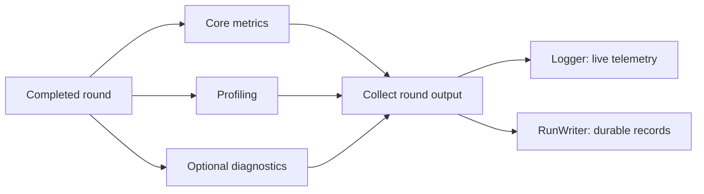

# Monitoring and Diagnostics

Monitoring collects round-level metrics, timing information, and optional
diagnostics, then sends them to live or durable outputs. Each completed round
produces core metrics and profiling timings. Diagnostics can add model and
component analysis.



| Part | What it does | When it is used | Where the result goes |
| --- | --- | --- | --- |
| Core metrics | Report round counts, costs, budgets, and observations. | Every completed round. | Any configured logger or run writer. |
| Profiling | Measure how long each phase of the round takes. | Every completed round. | Any configured logger or run writer. |
| Diagnostics | Add model and component analysis. | When `diagnostics.enabled` is `true` and an output is configured. | Any configured logger or run writer. |
| `Logger` | Show metrics and figures as the run progresses. | When `logger` is configured. | Console or experiment tracker. |
| `RunWriter` | Save reproducible round records and artifacts. | When `run_writer` is configured. | Local JSON, JSONL, CSV, and figure files. |

The logger and run writer are independent. Configure either one or both,
depending on whether you need live feedback, durable records, or both.

| Configuration | Behavior |
| --- | --- |
| Logger only, diagnostics enabled | Live core metrics, profiling, diagnostic metrics, and figures are submitted; no durable run records are written. |
| Run writer only, diagnostics enabled | Core metrics, profiling, diagnostics, and local figures are persisted; no tracker output is submitted. |
| Both sinks, diagnostics enabled | The same completed-round payload reaches both sinks; figures close after both consume them. |
| Either sink, diagnostics disabled | Core metrics and profiling still reach the output. Diagnostic mappings and figures are omitted, and temporary component data is cleared after the round. |
| Neither sink | No monitoring output is produced and optional diagnostic computation is skipped. |

## General Diagnostics

General diagnostics use round data and public component APIs. They do not fit a
model, query an oracle, or rescore candidates solely for monitoring.

| Component | Metrics |
| --- | --- |
| Surrogate | Current-round and rolling prequential RMSE, MAE, bias, $R^2$, predictive standard deviation, and 95% interval coverage. |
| Sampler | Duplicate fraction, overlap with previous observations, and sampled fidelity fractions when candidate identities are supported. |
| Oracle | Invalid-result failure rate and per-fidelity query counts and costs. |
| Dataset | Per-fidelity observation counts and best finite scalar target. |
| Budget | Round and cumulative utilization. |

The active-learning namespace also records absolute round values such as
proposed and selected counts, valid and invalid observations, round and
cumulative cost, and remaining budget. Profiling records the duration of each
instrumented phase together with total round time. Phase timers answer separate
performance questions and are not expected to sum to the round total.

Surrogate diagnostics use sequential, or prequential, evaluation. The model
fitted using data from earlier rounds predicts the candidates selected in the
current round. Those predictions are compared with oracle results only after
the results arrive, avoiding look-ahead bias. Current-round metrics cover all
finite scalar targets. Predictions are evaluated in batches of at most
`diagnostics.max_points`, and the same setting bounds retained prediction
history and rendered points. A current-round score can still be noisy when only
a few candidates are selected.

Built-in score-based selectors also report the values used during selection. The
standard score metrics are:

| Namespace | Metrics | Meaning |
| --- | --- | --- |
| `acquisition/general/sampled` | `count`, `mean`, `std`, `min`, `max` | Finite raw acquisition scores for the sampled pool. |
| `acquisition/general/selected` | `count`, `mean`, `std`, `min`, `max` | Finite raw acquisition scores for selected candidates. |
| `selector/general/ranking` | `mean`, `std`, `min`, `max` | Finite full-pool scores that drove ranking. |
| `selector/general/selected_ranking` | `mean`, `min`, `max` | Finite ranking scores for selected candidates. |

When figures are enabled, the sampled-versus-selected raw and ranking
distributions are emitted as
`acquisition/general/score_distribution`. Histogram inputs are bounded by
`diagnostics.max_points`; scalar summaries use every finite score. `nan`,
positive infinity, and negative infinity are omitted from summaries and plots.
An infinite cost-aware ratio can still determine selection, but is not reported
as a diagnostic value.

The main surrogate keys are:

```text
surrogate/general/held_out/current_round/rmse
surrogate/general/held_out/rolling/rmse
```

## Names And Artifacts

Values use a component-first slash-separated namespace:

```text
surrogate/general/held_out/rolling/rmse
sampler/general/duplicate_fraction
oracle/general/fidelity_3/cost_total
```

Implementation-specific values retain an implementation segment:

```text
sampler/s3gfn/train/contrastive_loss_mean
sampler/gflownet/validation/gflownet_loss
oracle/branin/query_landscape
```

Keys must contain lowercase safe identifier segments separated by `/`. General
component values use at least three segments, while the top-level
`active_learning/...` core values use their intentionally shorter namespace.
The syntax validator accepts custom component roots; the active-learning
orchestrator validates that a diagnostic drain uses the namespace of the
component that emitted it.

With `JSONLinesRunWriter`, figures are saved below the configured
`run_writer.output_dir` and referenced by relative paths in the round record:

```text
artifacts/oracle/branin/round_0003/query_landscape.png
artifacts/surrogate/general/round_0003/predicted_vs_observed.png
```

## Run Records

The run manifest stores initial observations once. Each line in
`round_history.jsonl` stores one completed round, including:

- `round_index`, costs, budgets, core metrics, profiling, and diagnostics;
- selected candidates and costs;
- optional sampled candidates when `write_samples` is enabled;
- `queried_observations` and `valid_observations`; and
- figure paths under `artifacts`.

The writer does not repeat the cumulative observation dataset in every round.
Offline benchmark loaders reconstruct a checkpoint by starting with
`initial_data.initial_observations` from the manifest and appending each round's
`valid_observations`. Raw queried observations remain available for inspecting
failed evaluations, while only valid observations enter the reconstructed
training dataset and objective trajectory.

## Configuration

Diagnostics are configured at the experiment level:

```yaml
diagnostics:
  enabled: true
  figure_interval: 1
  max_points: 1000
```

- `diagnostics.enabled` enables general and implementation-specific diagnostics
  when a logger or run writer is configured.
- `diagnostics.figure_interval` renders figures every $N$ completed rounds.
- `diagnostics.max_points` bounds surrogate prediction batch size, retained
  rolling prediction rows, and rendered points. It does not reduce the number
  of current-round rows used for scalar metrics.

Set `diagnostics.enabled: false` to skip general diagnostics.
Implementation-specific pending data is still drained and discarded at the
round boundary so it cannot leak into a later round.

Score snapshots are temporary arrays captured from values the built-in selector
already computed. Monitoring uses them once to calculate the round's summary
metrics and figure, then clears them. The arrays themselves are not stored in
`RoundRecord` or written to JSON-lines output. Custom selectors still only need
to implement the list-returning `__call__` contract; score telemetry is optional.

## Implementation-Specific Diagnostics

A component with round-local internal values may define this optional method:

```python
def drain_round_diagnostics(
    self,
    *,
    include_figures: bool,
    max_points: int,
) -> tuple[dict[str, int | float], dict[str, Figure]]:
    """Return and clear diagnostics for the completed active-learning round."""
```

The active-learning loop discovers this method without requiring changes to
component base classes. A drain must clear pending state, must not call
`Logger`, must not save files, and must not close figures it returns.
Acquisition and selector implementations may use this hook for optional
implementation-specific diagnostics without changing their public return types.

S3-GFN reports training health, generation validity and yield, reward
summaries, durations, and bounded training-loss, log-$Z$, and reward figures.
Its contrastive objective is named explicitly. The GFlowNet adapter retains
upstream metrics until the active-learning round ends; internal GFlowNet steps
do not advance the experiment tracker step. Branin and xTB oracles retain
their query figures until the same round boundary.

## Failure Behavior

General and implementation-specific diagnostic computation is best effort. A
failed diagnostic logs a warning and adds
`diagnostics/failures/<component>` for that round, while the experiment
continues. Duplicate diagnostic keys and malformed namespaces are programming
errors and raise.

Oracle result count, positional input identity when comparable, and fidelity
are core contract checks. Violations raise before filtering or dataset
mutation, because silently associating a label with the wrong candidate would
corrupt the experiment.

The built-in Comet logger disables Comet's automatic PyTorch metric hook. That
hook can report a generic bare `loss` value outside the framework namespace.
Comet credentials should be supplied through the `COMET_API_KEY` environment
variable rather than committed configuration.
