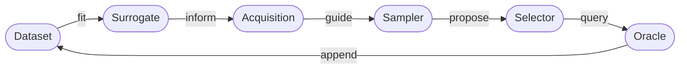

# **Framework Overview**

This framework provides a modular decision loop for budget-constrained discovery with an expensive black-box objective. When multiple fidelities are available, the acquisition algorithm must determine which candidate to query and which fidelity level to allocate. The objective is the cost-effective, budget-constrained discovery of high-scoring regions within the target space and, dependent on the configured search policy, the generation of a diverse set of high-performing candidates.

## **Problem Formulation**

Let $x \in \mathcal{X}$ denote a candidate within the object space, and let $m \in \mathcal{M}$ denote a discrete fidelity level. A single action within the active learning loop constitutes a candidate-fidelity query $(x, m)$.

Each query $(x, m)$ executed by the framework:

- Incurs a computational or oracle cost $c(x, m)$ dependent on the candidate $x$ and fidelity $m$.
- Returns an observation $y$ evaluated at the requested fidelity.
- Updates the surrogate model to inform subsequent rounds.

In single-fidelity environments, $m$ is static and implicit. In multi-fidelity environments, the selection of $m$ becomes an explicit dimension of the sequential decision-making problem.

## **Core Workflow**

The architectural execution loop follows this trajectory:

This decomposition guarantees experimental isolation: researchers can independently substitute any single component—the decision rule, the predictive model, the generative proposal mechanism, or the budget allocation policy—without modifying the underlying orchestration logic.

## **Component Architecture**

| Component | Methodological Role  | Operational Objective |
| --- |----------------------| --- |
| **Dataset** | State ($\mathcal{D}$) | Records observed candidate-fidelity queries and their outcomes. |
| **Surrogate** | Multi-fidelity probabilistic model of the oracle | Computes the predictive distribution over $(x, m)$ pairs. |
| **Acquisition** | Utility function     | Quantifies the cost-aware expected utility of proposed queries. |
| **Sampler** | Proposal mechanism   | Generates a tractable set of candidate-fidelity pairs for evaluation. |
| **Selector** | Budget-aware filter  | Subsets proposed queries to satisfy per-iteration budget constraints. |
| **Oracle** | Black-box evaluator  | Evaluates the objective $f(x)$ at fidelity $m$, realizing cost $c(x, m)$. |
| **Budget** | Constraint scheduler | Enforces strict per-iteration and total computational cost limits. |
| **Logger** | Experiment telemetry | Persists runtime metrics, model artifacts, and configurations. |
| **Runtime Context** | Infrastructure state | Synchronizes device (`cuda`/`cpu`) and tensor dtypes across modules. |

## **Unified Single- and Multi-Fidelity Execution**

The underlying execution architecture remains invariant across single-fidelity and multi-fidelity experiments. The primary shift occurs within the action space:

- In **single-fidelity** mode, the fidelity $m$ is fixed and implicit — the algorithm only chooses $x$.
- In **multi-fidelity** mode, $m$ becomes an explicit decision variable, and the acquisition function must weigh the cost-utility trade-off of querying $(x, m)$ pairs.

!!! tip "Same config structure for both settings"
    The same YAML schema works for both settings, provided you use multi-fidelity-compatible components. When doing so, extending `oracle.fidelity_costs` and `sampler.fidelities` is all that is required. Note that some components are single-fidelity only — for example, `TopKAcquisitionSelector` ignores cost entirely and should be replaced by `CostAwareSelector` in a multi-fidelity setting; similarly, analytic acquisition functions (e.g. `UpperConfidenceBound`, `ExpectedImprovement`) do not support multi-fidelity, and a dedicated multi-fidelity acquisition such as `QMultiFidelityLowerBoundMaxValueEntropy` must be used instead. The [Synthetic Function Examples](../tutorials/synthetic_function_experiment.md) tutorial walks through both side-by-side.

## **Pool-Based, Stream-Based, and *De Novo* Query Synthesis**

The framework is flexible enough to support classical pool-based active learning (selecting from a finite pre-computed candidate set), stream-based active learning (deciding whether to label each incoming candidate), or ***de novo* query synthesis** (generating candidates directly from the object space $\mathcal{X}$). The sampler abstraction is the key: it can draw proposals from a fixed pool, a data stream, or synthesize them from scratch.

!!! info "Why de novo synthesis for scientific discovery?"
    In scientific discovery settings — materials design, drug discovery, automated experimentation — frequently no exhaustive candidate pool exists upfront. The goal is also not global prediction accuracy, but to isolate a diverse set of candidates with high objective values. *De novo* synthesis is therefore the paradigm of primary interest for these use cases.

## **Relationship to Standard Optimization Paradigms**

This framework synthesises Bayesian Optimization (BO), Active Learning, and Active Search: it uses BO-style surrogates and acquisitions within an iterative active learning loop, pursuing diversity among high-scoring candidates (as in active search), all bounded by multi-fidelity budget constraints.

For a more detailed discussion of how this framework relates to prior work, see [Related Work and Positioning](related-work.md).

## **Suggested Reading Order**

1. [Active Learning Loop](active_learning_loop.md)
2. [Multi-Fidelity Setting](multi_fidelity.md)
3. [Runtime and Configuration](runtime_and_configuration.md)
