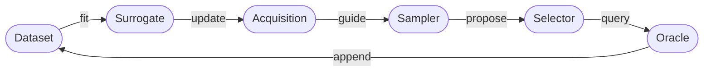

# Framework Overview

This framework provides a modular decision loop for budget-constrained discovery with an expensive black-box objective. When multiple fidelities are available, the acquisition algorithm must determine which candidate to query and which fidelity level to allocate. The objective is the cost-effective, budget-constrained discovery of high-scoring regions within the target space and, dependent on the configured search policy, the generation of a diverse set of high-performing candidates.

## Problem Formulation

Let $x \in \mathcal{X}$ denote a candidate within the object space, and let $m \in \mathcal{M}$ denote a discrete fidelity level. A single action within the active learning loop constitutes a candidate-fidelity query $(x, m)$.

Each query $(x, m)$ executed by the framework:

- Incurs a computational or oracle cost $c(x, m)$ dependent on the fidelity $m$.
- Returns an observation $y$ evaluated at the requested fidelity.
- Updates the surrogate model to inform subsequent rounds.

In single-fidelity environments, $m$ is static and implicit. In multi-fidelity environments, the selection of $m$ becomes an explicit dimension of the sequential decision-making problem.

## Core Workflow

The architectural execution loop follows this trajectory:

This decomposition guarantees experimental isolation: researchers can independently substitute any single component—the decision rule, the predictive model, the generative proposal mechanism, or the budget allocation policy—without modifying the underlying orchestration logic.

## Component Architecture

| Component | Methodological Role | Operational Objective |
| --- | --- | --- |
| **Dataset** | State ($\mathcal{D}$) | Records observed candidate-fidelity queries and their outcomes. |
| **Surrogate** | Probabilistic model | Computes the predictive distribution over $(x, m)$ pairs. |
| **Acquisition** | Utility function | Quantifies the cost-aware expected utility of proposed queries. |
| **Sampler** | Proposal mechanism | Generates a tractable set of candidate-fidelity pairs for evaluation. |
| **Selector** | Budget-aware filter | Subsets proposed queries to satisfy per-iteration budget constraints. |
| **Oracle** | Black-box evaluator | Evaluates the objective $f(x)$ at fidelity $m$, realizing cost $c(x, m)$. |
| **Budget** | Constraint scheduler | Enforces strict per-iteration and total computational cost limits. |
| **Logger** | Experiment telemetry | Persists runtime metrics, model artifacts, and configurations. |
| **Runtime Context** | Infrastructure state | Synchronizes device (`cuda`/`cpu`) and tensor dtypes across modules. |

## Unified Single- and Multi-Fidelity Execution

The underlying execution architecture remains invariant across single-fidelity and multi-fidelity experiments. The primary shift occurs within the action space and the dimensionality of the tensors passed between modules:

- Candidates and observations encode fidelity state.
- The surrogate model integrates fidelity-specific confidence intervals provided by the oracle.
- The acquisition function scores the cost-utility trade-off of $(x, m)$ pairs rather than just $x$.
- The selector trades predicted utility against the remaining computational budget.
- The framework queries lower-fidelity oracles to map the objective space cost-effectively before escalating to the highest-fidelity target oracle.

This design allows the same orchestration code to support several research settings.

## Core Implementation Principles

Several design choices define this repository:

- **Config-Driven Experiments:** YAML files dictate component selection and hyperparameter instantiation entirely.
- **PyTorch-Native Runtime:** Hardware acceleration and precision states are propagated natively across all runtime-aware components.
- **Modular Multi-Fidelity Support:** Fidelity-aware data structures, oracles, surrogates, and acquisition functions operate strictly behind common interfaces.
- **Generative Flow Network (GFlowNet) Integration:** The repository provides optional GFlowNet samplers for generative candidate proposal; however, end-to-end multi-fidelity GFlowNet pipelines are still under active development (see [Paper Replication](../paper_replication/index.md)).

## Pool-Based Learning vs. *De Novo* Query Synthesis

While classical active learning literature largely focuses on *pool-based active learning*—where the algorithm selects observations from a finite, pre-computed pool of unlabelled data—this framework targets ***de novo* query synthesis**. Here, the algorithm dynamically generates and evaluates samples drawn from the continuous or combinatorially massive object space $\mathcal{X}$. This paradigm is specifically tailored for scientific discovery domains (King et al., 2004; Xue et al., 2016; Yuan et al., 2018; Kusne et al., 2020).

In applied scientific research, the objective is rarely to globally minimize surrogate prediction error across the entirety of $\mathcal{X}$. Rather, it is to isolate and discover diverse candidates exhibiting maximized values of the objective function $f(x)$. Consequently, *de novo* synthesis is the optimal approach for materials design, drug discovery, and automated experimental optimization.

## Relationship to Standard Optimization Paradigms

**Bayesian Optimization (BO):** BO fundamentally seeks the global optimum of an expensive objective $f(x)$, utilizing surrogate models (e.g., Gaussian Processes) paired with acquisition functions (e.g., Expected Improvement). Its strict goal is to minimize the total evaluations required to locate $\arg\max f(x)$. This framework leverages BO-style surrogates and acquisitions but diverges in its terminal objective: rather than converging on a single optimal point, it forces the discovery of *diverse sets* of high-performing candidates.

**Standard Active Learning:** Traditional active learning attempts to minimize a model's global prediction error, selecting queries that maximize information gain or reduce posterior variance uniformly across the input space. This framework fundamentally rejects global uncertainty reduction in favor of targeted exploration within high-value regions.

**Active Search:** Active search (Garnett et al., 2012; Jiang et al., 2017) aligns most closely with this framework's theoretical goals: maximizing the total number of discovered targets (candidates exceeding a threshold for $f(x)$) under a strict query budget. This framework scales the active search paradigm into the multi-fidelity regime, introducing dynamic cost variables $c(x, m)$ to the decision-making loop.

In summary, this framework synthesizes these three paradigms: it employs BO-driven modeling within an active learning operational loop, pursuing the high-value spatial diversity characteristic of active search, all strictly bounded by a multi-fidelity finite budget constraints.

## Suggested Reading Order

1. [Active Learning Loop](active_learning_loop.md)
2. [Multi-Fidelity Active Learning](multi_fidelity.md)
3. [Runtime and Configuration](runtime_and_configuration.md)
