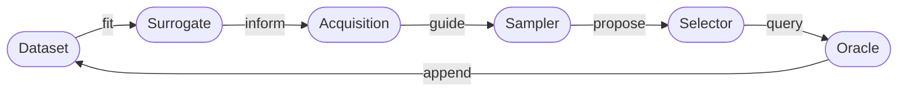

# Extension Guide

The multi-fidelity active learning framework is designed for extension. Every
component in the active-learning loop can be replaced independently:



Extending the framework — replacing or adding oracles, surrogates, samplers,
selectors, or acquisitions — is the primary intended use; all other loop
components operate without modification.

## The common extension recipe

Every component follows the same four-step pattern:

**1. Implement** your class by subclassing the relevant abstract base.

```python
# src/activelearning/oracle/my_oracle.py
from activelearning.oracle.oracle import Oracle

class MyOracle(Oracle):
    def get_fidelity_confidences(self) -> dict[int, float]: ...
    def get_costs(self, candidates): ...
    def query(self, candidates): ...
```

**2. Add a Pydantic config model** with a `type` literal and a `build()` method.

```python
# src/activelearning/oracle/config.py  (additions)
from activelearning.oracle.my_oracle import MyOracle

class MyOracleConfig(BaseModel):
    type: Literal["MyOracle"] = "MyOracle"
    # your parameters here

    def build(self) -> Oracle:
        return MyOracle(...)
```

**3. Register** that config model in the component's `config.py` by adding it to the `Union` type alias.

```python
OracleConfig = Annotated[
    Union[..., MyOracleConfig],
    Field(discriminator="type"),
]
```

**4. Point your YAML** at the new `type`.

```yaml
# config.yaml
oracle:
  type: MyOracle
```

## Runtime context

All components inherit from [`ALRuntimeMixin`](../api/runtime_and_types.md#activelearning.runtime.ALRuntimeMixin). The runtime context (device, dtype,
logger) is **bound after `build()`** — avoid using it in `__init__()`. Access it
inside your methods instead:

```python
class MyOracle(Oracle):
    def query(self, candidates):
        x = torch.tensor([c.x for c in candidates], dtype=self.dtype, device=self.device)
        self.logger.info("querying %d candidates", len(candidates))
        ...
```

The sampler is the only component whose `build()` receives `runtime` directly
(see [Sampler guide](sampler.md#config-model-and-registration)).

## Quick reference: what to extend
<div class="schema-table" markdown>

| If you need to change… | Extend… | Key method(s) |
|---|---|---|
| Evaluation rule, simulator, benchmark, fidelity levels | [`Oracle`](oracle.md) | `get_fidelity_confidences()`, `get_costs()`, `query()` |
| Candidate proposal strategy, search space | [`Sampler`](sampler.md) | `sample()` |
| Predictive model (GP, NN, ensemble…) | [`Surrogate`](surrogate.md) | `updates_from_latest()`, `fit()` / `update()`, `predict()` |
| Information criterion, scoring function | [`Acquisition`](acquisition.md) | `update()`, `score()` |
| Round budget allocation, candidate selection | [`Selector`](selector.md) | `__call__()` |

</div>

## Detailed guides

- [Oracle](oracle.md) — add a new evaluation mechanism
- [Sampler](sampler.md) — add a new candidate proposal strategy
- [Surrogate](surrogate.md) — add a new predictive model
- [Acquisition](acquisition.md) — add a new information criterion
- [Selector](selector.md) — add a new budget allocation policy
