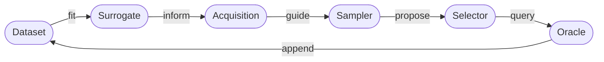

# **Extension Guide**

The multi-fidelity active learning framework is designed for extension. Every
component in the active-learning loop can be replaced independently:



Extending the framework — replacing or adding datasets, surrogates,
acquisitions, samplers, selectors, oracles, loggers, and encoders — is the
primary intended use; all other loop components operate without modification.

Keep reusable, domain-specific components in an application distribution that
depends on `activelearning`; the dependency direction must not point from core
back to an application. Concrete implementations may import optional runtime dependencies lazily from
`build()` so importing an application's composition root remains lightweight.

## **The common extension recipe**

Every public polymorphic component follows the same four-step pattern:

**1. Implement** your class by subclassing the relevant abstract base.

```python
# src/activelearning/oracle/my_oracle.py
from activelearning.oracle.oracle import Oracle

class MyOracle(Oracle):
    def get_fidelity_confidences(self) -> dict[int, float]: ...
    def get_costs(self, candidates): ...
    def query(self, candidates): ...
```

**2. Add a Pydantic config model** with a `type` literal and a `build()` method.

```python
# my_package/config.py
from typing import Literal

from activelearning.config_registry import BuildableConfig
from my_package.oracle import MyOracle

class MyOracleConfig(BuildableConfig):
    type: Literal["MyOracle"] = "MyOracle"
    # your parameters here

    def build(self) -> Oracle:
        return MyOracle(...)


ORACLE_CONFIGS = (MyOracleConfig,)
```

The catalog is the explicit routing list for that category. When the package
already provides oracles, adding another oracle requires changing only this
file.

**3. Aggregate each category catalog once** in the distribution:

```python
# my_package/config_catalogs.py
from my_package.config import ORACLE_CONFIGS

CONFIG_CATALOGS = {
    "oracle": ORACLE_CONFIGS,
}
```

Core's built-in schemas use the same mapping shape. The module name is the only
framework convention; no package metadata hook is required.

**4. Compose the application command** with the catalog mapping:

```python
# my_package/main.py
from activelearning.main import run
from my_package.config_catalogs import CONFIG_CATALOGS

run(
    catalogs={"my-package": CONFIG_CATALOGS},
    program_name="my-package",
)
```

The application command imports its own catalog directly and composes it with
the core catalogs before parsing the experiment. The experiment YAML only needs
the component type:

```yaml
oracle:
  type: MyOracle
```

This direct composition is intentional for known application packages. If the
framework later supports arbitrary third-party extensions that should activate
merely by being installed, Python package entry points would be the appropriate
discovery mechanism.

The supported catalog categories are `dataset`, `surrogate`, `acquisition`,
`sampler`, `selector`, `oracle`, `logger`, and `encoder`. Runtime settings,
budgets, diagnostics, run writers, budget schedules, and acquisition
candidate-set specifications remain local typed models because they are not
cross-distribution component extension points.

## **Runtime context**

All components inherit from [`ALRuntimeMixin`](../reference/activelearning/runtime/#activelearning.runtime.ALRuntimeMixin). The runtime context (device, dtype,
logger) is **bound after `build()`** — avoid using it in `__init__()`. Access it
inside your methods instead:

```python
class MyOracle(Oracle):
    def query(self, candidates):
        x = torch.tensor([c.x for c in candidates], dtype=self.dtype, device=self.device)
        self.logger.info("querying %d candidates", len(candidates))
        ...
```

The sampler is the only component whose `build()` receives `runtime` directly
(see [Sampler guide](sampler.md#config-model-and-registration)).

## **Quick reference: what to extend**
<div class="schema-table" markdown>

| If you need to change…                                                   | Extend… | Key method(s)                                                                                                     |
|--------------------------------------------------------------------------|---|-------------------------------------------------------------------------------------------------------------------|
| Evaluation rule, simulator, benchmark, fidelity levels                   | [`Oracle`](oracle.md) | `get_fidelity_confidences()`, `get_costs()`, `query()`                                                            |
| Candidate proposal strategy, search space                                | [`Sampler`](sampler.md) | `sample()`                                                                                                        |
| Predictive model (GP, NN, ensemble…)                                     | [`Surrogate`](surrogate.md) | `updates_from_latest()`, `is_fitted()`, `fit()` / `update()`, `predict()`                                         |
| Information criterion, scoring function                                  | [`Acquisition`](acquisition.md) | `update()`, `score()`                                                                                             |
| Per-round budget allocation and budget cost schedule                     | `Budget` | `get_round_budget()`, `consume()`, `can_afford()`                                                                  |
| Candidate selection policy (ranking/constraints within the round budget) | [`Selector`](selector.md) | `__call__()`                                                                                                      |
| Observation storage/retrieval semantics                                  | `Dataset` | `add_observations()`, `get_observations_iterable()`, `get_latest_observations_iterable()`, `get_best_candidates()` |
| Experiment tracking backend(s)                                           | `Logger` | `log_config()`, `log_metric()`, `log_figure()`, `log_step()`, `end()`                                             |

</div>

## **Detailed guides**

- [Oracle](oracle.md) — add a new evaluation mechanism
- [Sampler](sampler.md) — add a new candidate proposal strategy
- [Surrogate](surrogate.md) — add a new predictive model
- [Acquisition](acquisition.md) — add a new information criterion
- [Selector](selector.md) — add a new candidate selection policy
