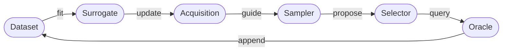

# Multi-Fidelity Active Learning

This framework provides a modular, config-driven environment for **Multi-Fidelity Active Learning** under a finite oracle budget. The algorithm selects candidate-fidelity pairs $(x, m)$ to cost-effectively discover high-scoring regions of an expensive black-box objective — querying cheap low-fidelity approximations to guide the search before committing to costly high-fidelity evaluations.

For a deeper conceptual introduction, start with the [Framework Overview](concepts/overview.md). To learn more about the research motivating this framework, see [References and Citation](resources/references.md).

## Framework Architecture

Each component — surrogate, acquisition, sampler, selector, oracle, budget, and logger — is defined in a YAML config file and can be swapped independently. See [Active Learning Loop](concepts/active_learning_loop.md) for how these interact at runtime.

## Getting Started

-   :material-download-circle:{ .lg .middle } **Install & Run**

    ---

    Install the library and run a first end-to-end experiment in minutes.

    [:octicons-arrow-right-24: Installation](getting-started/installation.md)
    · [Quickstart](getting-started/quickstart.md)

-   :material-book-open-variant:{ .lg .middle } **Understand the Framework**

    ---

    Learn the multi-fidelity active learning methodology and the execution loop in depth.

    [:octicons-arrow-right-24: Framework Overview](concepts/overview.md)
    · [Active Learning Loop](concepts/active_learning_loop.md)
    · [Multi-Fidelity AL](concepts/multi_fidelity.md)

-   :material-puzzle-edit:{ .lg .middle } **Extend to Your Use Case**

    ---

    Implement custom surrogates, acquisitions, samplers, selectors, or oracles.

    [:octicons-arrow-right-24: Extension Guide](extension-guide/index.md)
    · [API Reference](api/index.md)

-   :material-flask-outline:{ .lg .middle } **Run Experiments**

    ---

    Start from the Branin tutorial, then branch into the Hartmann6D tutorial
    or add your own oracle.

    [:octicons-arrow-right-24: Branin Tutorial](tutorials/branin_experiment.md)
    · [Hartmann Tutorial](tutorials/hartmann_experiment.md)
    · [Examples](examples/configs.md)

