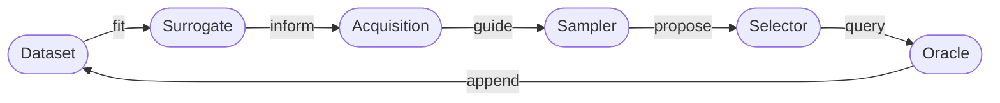

# **Multi-Fidelity Active Learning**

A Python framework for **multi-fidelity active learning** over combinatorially large and structured design spaces, with expensive black-box functions.

To evaluate candidates on a limited budget, this framework queries **oracles** (evaluation environments like simulations, pre-trained ML models, or lab experiments) across different **fidelity levels**. By blending fast, approximate estimates (low fidelity) with slow, highly precise measurements (high fidelity), it intelligently decides not just which candidate to try next, but at what fidelity.

Designed with a modular architecture, it provides a flexible foundation that allows users to easily swap components and extend the framework for novel research or custom workflows.

## **Framework Architecture**

At its core, the framework executes a **multi-fidelity active learning loop**: a surrogate model is fit to observed data, an acquisition function scores potential candidates, a sampler proposes the next batch, and a selector determines which candidate–fidelity pairs the oracle should evaluate next. The new observations are then added to the dataset for the next round of the active learning loop.

Every core component in this loop is designed to be strictly modular. This means they can be independently replaced or extended for specific research needs without altering the underlying execution code.

## **Getting Started**

-   :material-download-circle:{ .lg .middle } [**Install & Run**](getting-started/installation.md)

    ---

    Install the framework and run your first end-to-end experiment in minutes.

    [:octicons-arrow-right-24: Installation](getting-started/installation.md)
    · [Quickstart](getting-started/quickstart.md)

-   :material-book-open-variant:{ .lg .middle } [**Understand the Framework**](concepts/overview.md)

    ---

    Learn the methodology behind multi-fidelity active learning and how the execution loop operates under the hood.

    [:octicons-arrow-right-24: Framework Overview](concepts/overview.md)
    · [Active Learning Loop](concepts/active_learning_loop.md)
    · [Multi-Fidelity Setting](concepts/multi_fidelity.md)

-   :material-puzzle-edit:{ .lg .middle } [**Extend to Your Use Case**](extension-guide/overview.md)

    ---

    Implement custom surrogates, acquisition functions, samplers, selectors, or novel oracles.

    [:octicons-arrow-right-24: Extension Guide](extension-guide/overview.md)
    · [API Reference](reference/)

-   :material-flask-outline:{ .lg .middle } [**Run Experiments**](tutorials/synthetic_function_experiment.md)

    ---

    Start with standard benchmark tutorials (like Branin or Hartmann), then learn how to plug in your own custom oracles.

    [:octicons-arrow-right-24: Synthetic Function Examples](tutorials/synthetic_function_experiment.md)

