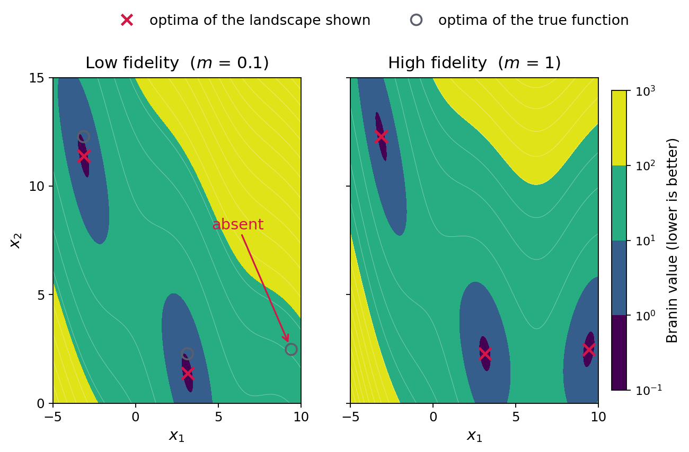
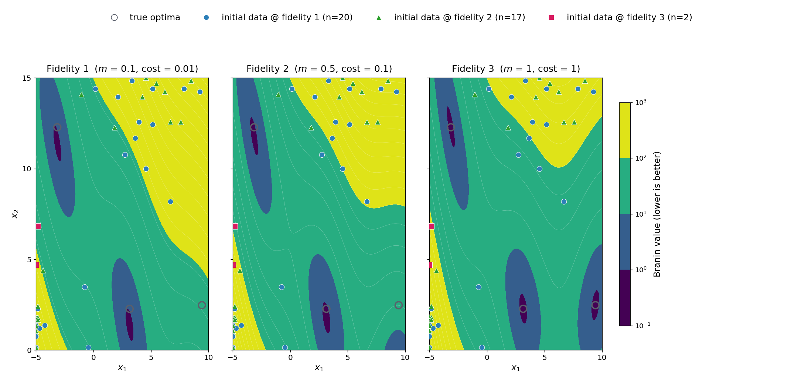
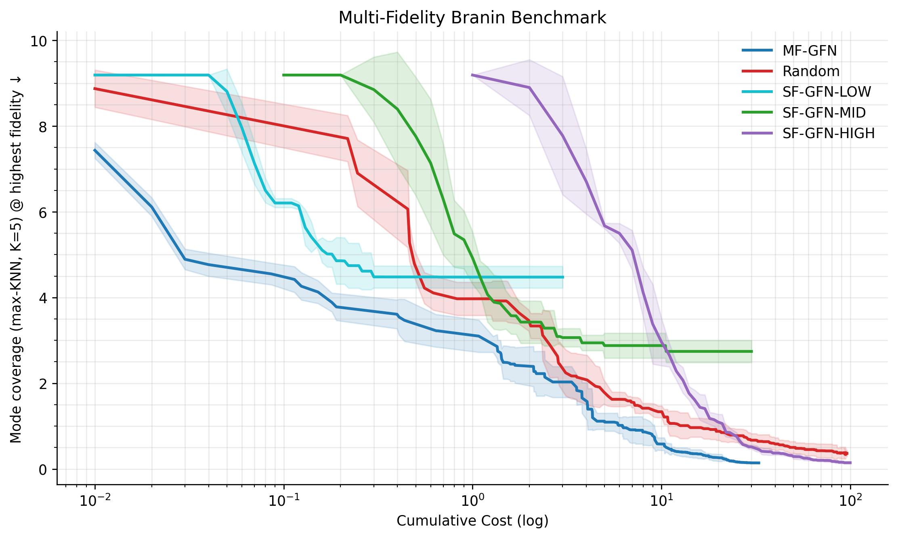

# **The Multi-Fidelity Branin Benchmark**

The Branin function is a two-dimensional synthetic objective with three known
global minima. This benchmark uses a negated, multi-fidelity version of Branin:
the framework searches for three maxima, or **modes**, and can query cheaper
approximations of the target landscape as well as the full-fidelity landscape.

The benchmark is intended to play a role similar to MNIST in image
classification: not to represent every real application, but to provide a
small, well-understood test bed in which failures can be diagnosed before a
method is scaled up. Known optima make coverage measurable, while controlled
query costs make the value of using multiple fidelities directly testable.

`config/branin_benchmark/` compares five methods across five random seeds. The
central question is whether a method with access to all three fidelities can
cover all three modes at lower cumulative cost than methods restricted to one
fidelity.

Before starting, complete [Installation](../getting-started/installation.md)
and make sure you can run and compose configs as described in
[Quickstart](../getting-started/quickstart.md) and
[Running Experiments](running_experiments.md).

## **Why a dedicated benchmark design?**

A useful comparison between multi-fidelity (MF) and single-fidelity (SF)
methods needs two properties:

- **Coverage-sensitive evaluation** — repeatedly acquiring additional
  high-scoring points near previously sampled modes should not obscure the
  fact that another mode was missed. The score should account for coverage
  across all modes.
- **Useful but imperfect cheap fidelities** — the cheap landscapes should
  preserve enough structure to guide exploration, yet omit information that
  can be recovered only by querying the highest fidelity. Otherwise, either
  the cheap levels are useless or the expensive level is unnecessary.

The benchmark therefore pairs a deliberately chosen fidelity structure with a
coverage metric tailored to the three known modes.

## **The localized fidelity gap**

Here, each lower fidelity represents a cheaper, approximate version of the
Branin landscape. As confidence decreases, the peaks shift and change in
relative value. The benchmark maps fidelity levels 1, 2, and 3 to confidence
values `0.1`, `0.5`, and `1.0`:

The figure compares endpoint fidelities 1 and 3; fidelity 2 is omitted for
readability.



Two modes shift only slightly and remain represented at every fidelity. The
third behaves differently: at fidelities 1 and 2, its basin is displaced beyond
the configured input domain. It is therefore absent from those landscapes and
appears only at fidelity 3, where confidence is `1.0`.

This creates a **localized fidelity gap**. Cheap queries still reveal two
important regions, but a method restricted to a cheap fidelity cannot recover
the third mode, regardless of how many queries it makes. Access to multiple
fidelities creates an opportunity to explore cheaply and use expensive,
full-fidelity observations only where they add information. It does not
guarantee that an algorithm will allocate its budget well; the benchmark is
designed to measure whether it does.

## **Evaluation metrics**

A common way to evaluate an optimization method is to average its $k$ highest
objective values, known as the **mean top-k** score. The plotting pipeline
computes this score after rescoring observations at full fidelity. It captures
the quality of the best observations, but not their diversity: many
high-scoring points around one or two modes can conceal a missed third mode.
This limitation motivates the need for a coverage metric.

The primary benchmark metric is therefore **max-KNN mode coverage** (lower is
better). The default is $K=5$:

1. For each of the three known Branin minima $m_i$, find its $K$ nearest
   labeled points (Euclidean distance in $x$-space).
2. Compute the average distance to those $K$ points.
3. Take the **maximum** of these per-mode averages across all three modes.

Taking the maximum makes the least-covered mode determine the result. The
metric reaches zero only if at least $K$ labeled points coincide with every
mode, and approaches zero as those neighborhoods become tighter. Increasing
$K$ asks each method to build denser coverage around every mode. With $K=1$,
the metric is the maximum distance from any known mode to its nearest
labeled point (a directed Hausdorff distance).

The recorded runs illustrate why this distinction matters. At similar final
costs (`30.0` and `32.79`), `SF-GFN-MID` has a slightly higher mean top-50
score than `MF-GFN` (`-0.46` versus `-0.49`, where higher is better). That
metric alone would not reveal the missed mode. Max-KNN coverage does:
`SF-GFN-MID` scores `2.74`, while `MF-GFN` scores `0.14` (lower is better).
See [Generating the plots](#generating-the-plots) for how both metrics are
computed from the recorded observations.

## **Benchmark configuration**

Every method shares the same protocol:

- The same surrogate (`BoTorchGPSurrogate`), acquisition
  (`QMultiFidelityLowerBoundMaxValueEntropy`), and selector
  (`TopKAcquisitionSelector`).
- Propose 10 candidate-fidelity pairs per round, score them with the
  acquisition function, and query the highest-scoring one
  (`selector.num_samples: 1`).
- Stop when cumulative query cost reaches `100.0` or after `300` rounds,
  whichever happens first. The round cap prevents methods using cheap
  fidelities from making an arbitrarily large number of queries, so some runs
  finish with unused cost budget.
- Oracle fidelities `[1, 2, 3]` with costs `[0.01, 0.1, 1.0]` and confidences
  `[0.1, 0.5, 1.0]`. Cost determines budget consumption; confidence determines
  which deformed Branin landscape is evaluated.
- The same 37 unique initial $x$-locations across all methods. The MF method
  observes 20 at fidelity 1, 17 at fidelity 2, and 2 at fidelity 3; each SF
  baseline observes all 37 at its one available fidelity.

The figure shows the MF initial dataset overlaid on each landscape. Marker
style indicates the fidelity at which each point was observed, even when that
marker is displayed over a different panel for comparison. No initial point
is close to the third target mode—the nearest is more than 6 input-space units
away—so the initial data do not give any method free information about that mode.



Only two experimental factors vary: how candidate-fidelity pairs are
*proposed* and which fidelities are available.

| Method | Overlay | Proposal | Fidelity levels |
| --- | --- | --- | --- |
| **MF-GFN** | `mf_gfn.yaml` | Cost-adjusted, acquisition-weighted grid | `1, 2, 3` |
| **Random** | `random.yaml` | Uniform continuous samples and uniformly assigned fidelities | `1, 2, 3` |
| **SF-GFN-LOW** | `sf_low_fid.yaml` | Cost-adjusted, acquisition-weighted grid | `1` only |
| **SF-GFN-MID** | `sf_mid_fid.yaml` | Cost-adjusted, acquisition-weighted grid | `2` only |
| **SF-GFN-HIGH** | `sf_high_fid.yaml` | Cost-adjusted, acquisition-weighted grid | `3` only |

The **Random** baseline proposes locations uniformly over the continuous
domain and assigns the three fidelities uniformly. It still queries the
highest-acquisition candidate among the 10 proposals, like every other
method, so it is a random-proposal baseline rather than a fully random search.
Because it also uses a continuous proposal instead of the finite grid, the
comparison reflects the complete proposal mechanism, not acquisition
weighting alone.

Each SF baseline exposes only one fidelity to the same framework components.
This keeps the acquisition and selection rule fixed while changing the
fidelity information available to the method.

Despite the name, **MF-GFN does not train a GFlowNet in this benchmark**.
`ExactGridSampler` constructs a $100 \times 100$ spatial grid for each available
fidelity and samples candidate-fidelity pairs with probability proportional to
acquisition score divided by query cost. Thus, it samples directly from the
discrete target distribution that an ideally trained GFlowNet would represent.
This isolates the framework's behaviour under an ideal policy by removing
training error from the comparison. The environment's small, finite state
space makes this target distribution tractable and provides a precise reference
against which a trainable GFlowNet can be evaluated. `MF-GFN` therefore
represents the ideal policy exactly; it is not a policy learned from data. The
trainable [`GFlowNetSampler`](gflownet_sampler.md) is covered separately.

Each method is a shared `base.yaml` composed with one overlay:

```sh
uv run activelearning config/branin_benchmark/base.yaml config/branin_benchmark/<overlay>.yaml runtime.seed=<seed>
```

!!! tip
    Read both `base.yaml` and the selected overlay before running. The base
    defines the shared protocol; the overlay changes the sampler, available
    fidelities, or initial data where required and sets the output name.

## **Running the benchmark**

Run the full benchmark with the bundled runner:

```sh
bash scripts/run_branin_benchmark.sh
```

The script composes `base.yaml` with each of the five overlays and runs seeds
`0` through `4`, for 25 runs in total. Each run writes
`run_manifest.json`, `round_history.jsonl`, and `run_summary.json` under
`outputs/branin_benchmark/<method>/seed_<seed>/`. The manifest records the
configuration and initial observations, the round history records the candidates,
observations, and cumulative cost after each round, and the summary stores the
run's final results. The plotting script uses the manifest and round history to
reconstruct the metrics at each checkpoint; the summary is useful for quickly
reviewing an individual run without parsing its full history.

## **Generating the plots**

Once all runs complete, generate the comparison figures with:

```sh
uv run python scripts/plot_branin_benchmark.py
```

This produces, under `plots/`:

- `branin_benchmark_mean_top_k.png` / `branin_benchmark_mean_top_k_log.png` —
  mean top-50 rescored score vs. cumulative cost (higher is better), linear
  and log-scale cost axis.
- `branin_benchmark_mode_coverage.png` / `branin_benchmark_mode_coverage_log.png` —
  max-KNN mode coverage vs. cumulative cost (lower is better), linear and
  log-scale cost axis.

At each checkpoint, both metrics use the cumulative labeled set: the initial
data plus every valid observation collected so far. Mean top-k reevaluates all
locations at confidence `1.0`, so observations made at different fidelities
are compared on the same target landscape. Mode coverage depends only on the
locations and their distances to the three known target modes.

Use `--metric`, `--scale`, `--top-k`, and `--coverage-k` to generate a subset
or change metric parameters. Run the script with `--help` for all options.

!!! note "Reusing the plotting pipeline"
    Generic artifact loading, cross-seed aggregation, and curve rendering live
    in `activelearning.utils.plotting`. The Branin script adds only the
    benchmark-specific rescoring and mode-coverage calculations.

## **Results**

The bundled 5-method, 5-seed run produces the following mode-coverage
comparison. A logarithmic cost axis is used because cumulative costs span
several orders of magnitude:



The horizontal axis is cumulative oracle cost, not round number; the vertical
axis is max-KNN mode coverage, where lower is better. Each line is the mean
across available seeds at a given round, and the shaded region is one sample
standard deviation.

- **SF-GFN-LOW and SF-GFN-MID plateau.** Both locate two optima cheaply, then
  flatten: the third optimum is absent from their fidelity level, so no amount
  of further querying can recover it.
- **Random proposal is less efficient than acquisition-weighted proposal.**
  Its selector still uses the acquisition function, but its 10 proposals per
  round do not. The resulting curve remains above MF-GFN throughout their
  overlapping observed cost range.
- **SF-GFN-HIGH covers all three modes, but at high cost.** Every query uses
  the target landscape and costs 100 times as much as fidelity 1. It reaches
  final mean coverage of `0.15` when the `100.0` cost budget is exhausted.
- **MF-GFN obtains the best final cost-coverage trade-off in this test.** At
  its 300-round limit, it reaches mean coverage of `0.14` at mean cumulative
  cost `32.79`, comparable to SF-GFN-HIGH's coverage at roughly one third of
  the cost. This result is consistent with the intended benefit of combining
  cheap exploration with selected full-fidelity queries; the coverage curve
  alone does not establish where or why each query was chosen.

!!! note "Scope of the result"
    This benchmark is a controlled diagnostic, not evidence that one method
    will dominate on every multi-fidelity problem. Its purpose is to test
    whether an implementation can exploit a known fidelity structure under a
    shared budget and evaluation protocol.

## **What comes next**

You now have a minimal benchmark for comparing fidelity-restricted and
multi-fidelity search under a shared protocol. Natural follow-ups include:

- adapting the configs to your own oracle — see the
  [Extension Guide](../extension-guide/overview.md),
- reading [Multi-Fidelity Setting](../concepts/multi_fidelity.md) for a deeper
  treatment of how fidelity costs and confidences propagate through the loop,
- or replacing the exact-reference sampler with a *trainable* generative model
  — see the [GFlowNet Sampler](gflownet_sampler.md) tutorial.
