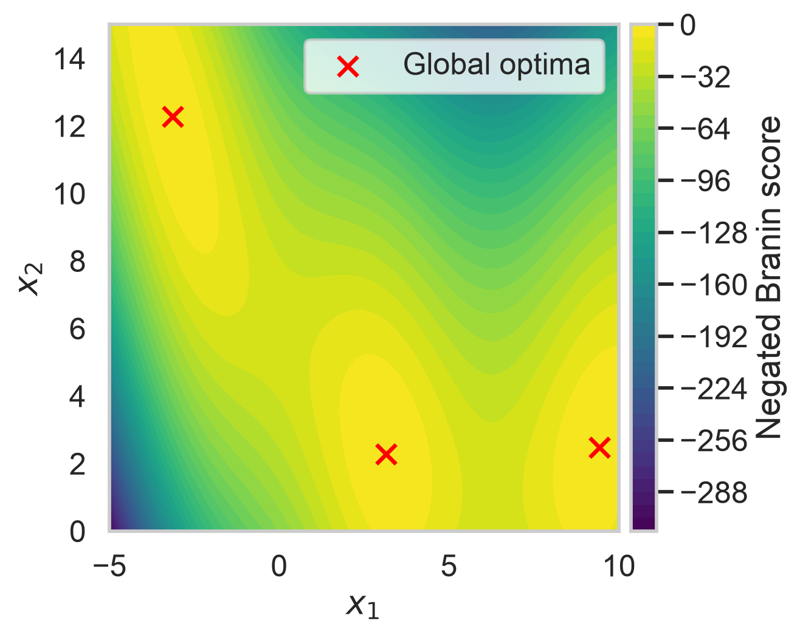
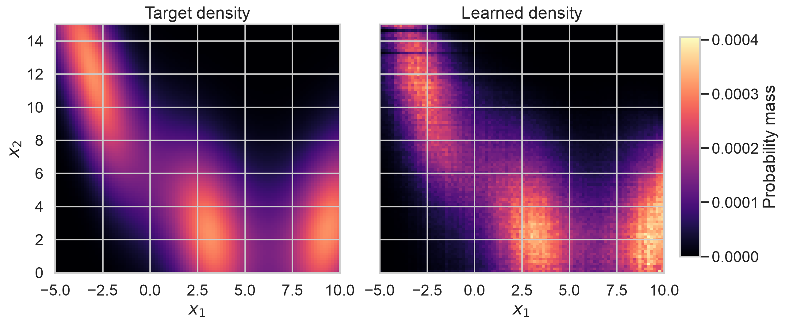
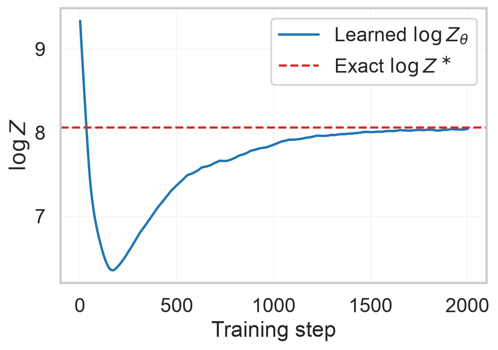
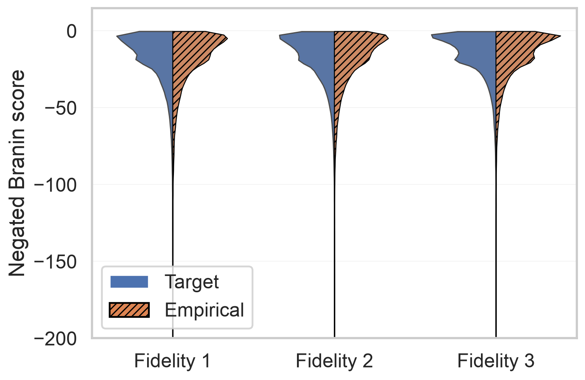

# **Sampling using GFlowNets**

GFlowNets are amortised samplers trained to generate diverse, high-scoring candidates with probability proportional to a reward function.

Before starting, make sure you have completed [Installation](../getting-started/installation.md).

## **What is a GFlowNet?**

A GFlowNet (Generative Flow Network) is an amortised sampler that learns a stochastic policy $\pi_\theta$ generating objects $x \in \mathcal{X}$ with probability proportional to a non-negative reward $R(x)$:

$$\pi_\theta(x) \propto R(x).$$

Candidates are built step by step along a trajectory $\tau = (s_0 \to s_1 \to \ldots \to x)$, with transitions drawn from a forward policy $P_F(s_{t+1} \mid s_t; \theta)$. GFlowNets are trained to spread probability mass across all modes of $R$, which can help discover multiple high-reward regions — though exact mode coverage is only guaranteed at zero loss over all trajectories, which is rarely achieved in practice. This diversity-seeking behaviour nonetheless contrasts favourably with RL-based alternatives, which tend to collapse onto a single mode.

!!! note "The partition function $Z$"
    The normalising constant $Z = \sum_{x \in \mathcal{X}} R(x)$ is called the *partition function*. It cannot be computed directly for large search spaces, so the GFlowNet learns a trainable estimate $Z_\theta$ alongside the policy via the **trajectory balance** objective ([Malkin et al., 2022](https://arxiv.org/abs/2201.13259)). Trajectory balance is satisfied exactly when $\pi_\theta(x) \propto R(x)$, so $\log Z_\theta$ converging toward $\log Z$ is a direct signal that training has succeeded — see [Training convergence](#training-convergence-log-z) below.

!!! note "GFlowNet background"
    GFlowNets were introduced by [Bengio et al., 2021a](https://arxiv.org/abs/2106.04399) and further formalised in [Bengio et al., 2021b](https://arxiv.org/abs/2111.09266). For architectures and training objectives see the [alexhernandezgarcia/gflownet](https://github.com/alexhernandezgarcia/gflownet) library.

## **GFlowNets in active learning**

In an active learning loop the reward is defined from the **acquisition function**: $R(x, m) = f(\alpha(x, m); \beta)$, where $f$ is a tempered non-negativity transform (exponential or power) controlled by a temperature $\beta$. This step — mapping raw acquisition scores, which may be negative or span many orders of magnitude, to a non-negative reward — is handled by the GFlowNet library's [proxy component](#reward-function) (see [Hernandez-Garcia et al., 2023](https://arxiv.org/abs/2306.11715), Appendix C.3).

Each call to [`sample()`](../reference/activelearning/sampler/sampler/#activelearning.sampler.sampler.Sampler.sample) trains a fresh policy $\pi_\theta$ against the current $R$. The GFlowNet learns to sample proportionally to the acquisition function defined by the current surrogate. As a result, shifts in sampling behaviour across rounds — such as broader exploration early on or tighter concentration around optima later — are primarily driven by how the acquisition function changes as the surrogate is updated. That said, round-to-round variability in GFlowNet training quality (e.g., due to stochasticity or incomplete convergence) can also influence sampling behaviour. In multi-fidelity settings, the policy samples jointly over objects and fidelities $(x, m)$, amortising expensive high-fidelity queries over cheap low-fidelity exploration.

!!! note "Reference"
    The multi-fidelity GFlowNet active learning algorithm is described in [Hernandez-Garcia et al., 2023](https://arxiv.org/abs/2306.11715), TMLR 2024.

## **Watching the sampler learn**

To build intuition for what the sampler is actually doing, the figures below show a GFlowNet trained against the Branin oracle on a discrete 2D grid. Because we know the oracle here we can compare the empirical sample distribution against the exact target — a luxury not available in a real AL run, where the reward comes from an opaque acquisition function.

### The Branin oracle



The negated Branin function has three equivalent global minima (red ✕) separated by low-score valleys. This is the landscape the GFlowNet will be trained to sample peaks of — every figure below should be read with reference to these three target regions.

### Sampling the reward landscape



The left panel is the theoretical target $p(x) \propto \exp(\beta \cdot \text{score}(x))$ — the distribution the GFlowNet is trained to match. The right panel is the exact terminal-state marginal induced by the learned forward policy on the same discrete grid, computed by summing probability mass over all forward trajectories that terminate at each grid cell. A well-trained GFlowNet lights up all three target regions in roughly the same pattern as the left panel; diffuse mass indicates under-training or a $\beta$ that is too small, while concentration on only one peak indicates mode collapse or a $\beta$ that is too large.

### Training convergence ($\log Z$)



The blue curve is the running estimate $\log Z_\theta$; the red dashed line is the exact $\log Z^* = \log \sum_{x, m} R(x, m)$ obtained by enumerating the discrete grid. Convergence of $\log Z_\theta$ to $\log Z^*$ indicates that trajectory balance has reached its fixed point and the policy is sampling proportionally to $R$. A persistent gap usually means insufficient training steps or a poorly chosen `lr_z_mult` — see [Configuration reference](#configuration-reference).

!!! note "Interpreting $\log Z_\theta$ in practice"
    Computing $\log Z^*$ exactly requires enumerating every terminal state — feasible here, but intractable for realistic scientific discovery tasks. In those settings $\log Z_\theta$ can still be monitored as a convergence signal: it should rise steadily as the GFlowNet discovers high-reward regions and then plateau as probability flows reach equilibrium.

    A stable plateau is a **necessary** condition for correct proportional sampling. The Trajectory Balance objective requires $\log Z_\theta + \sum \log P_F \approx \log R(x) + \sum \log P_B$ across all trajectories; if $\log Z_\theta$ has not converged, this equality cannot hold globally and the policy cannot be sampling proportionally to $R$.

    It is **not sufficient**, however. $\log Z_\theta$ is a single global scalar and can converge cleanly to the partition function of only a subset of modes (mode collapse), or errors in $P_F$ and $P_B$ can cancel along specific paths while the marginal distribution over objects remains wrong.     Always evaluate $\log Z_\theta$ alongside empirical metrics — Top-$K$ score and Top-$K$ diversity — to build confidence that the policy is sampling meaningfully from the target distribution.

### Per-fidelity calibration



To illustrate what the GFlowNet actually learns, this figure compares the learned sampling distribution against the theoretical target across fidelities (only possible here because we have access to the ground-truth oracle). Each violin corresponds to one fidelity level: the left half (solid fill) is the $R(x, m)$-weighted theoretical score distribution at that fidelity; the right half (hatched, dashed edge) is the empirical distribution of GFlowNet samples at that fidelity. When the two halves mirror each other, the policy has learned to sample proportionally to $R$ at that fidelity level. In a real AL run the theoretical distribution is unavailable, so only the empirical right-hand side would be observable.
### Quality in a real AL run

When the reward is the acquisition function and the exact target is unknown, the quality proxies reported in the paper are:

- **Top-$K$ score** — mean oracle score of the $K$ highest-scoring samples; measures whether the policy found the good regions.
- **Top-$K$ diversity** — mean pairwise distance within the top-$K$ samples; catches mode collapse that a score-only metric would miss.

Both are reported automatically by the AL metric loggers — no manual instrumentation needed.

## **Running the provided configs**

The repository ships two ready-to-run Branin configs for the GFlowNet sampler.

### Single-fidelity

```sh
uv run activelearning config/branin/gflownet_single_fidelity.yaml
```

One fidelity level, fidelity cost `1.0`, total budget `300`, round budget `30`.

### Multi-fidelity

```sh
uv run activelearning config/branin/gflownet_multi_fidelity.yaml
```

Three fidelity levels with costs `0.01 / 0.1 / 1.0`. The GFlowNet jointly samples $(x, m)$ proportionally to the acquisition function, amortising high-fidelity oracle queries over cheap low-fidelity exploration.

!!! tip "Quick sanity check and swapping oracles"
    Use `budget.available_budget=30.0` to preview a short run before committing to a full experiment. To apply the same sampler to a different oracle, point `oracle.type` at your own class and update `cell_min`/`cell_max` in `conf.env` to match the new domain — nothing else needs to change.

## **Configuration reference**

The sections below document every significant knob in the multi-fidelity config (`config/branin/gflownet_multi_fidelity.yaml`).

### Core sampler fields

```yaml
sampler:
  type: GFlowNetGridSampler   # grid-based GFlowNet for bounded continuous spaces
  n_samples: 100              # candidates returned per sample() call
  fidelities: [1, 2, 3]      # list of fidelity levels; use [<id>] for single-fidelity (omitting auto-fills from oracle)
```

### Grid environment

```yaml
  conf:
    env:
      n_dim: 2       # dimensionality of the search space
      length: 100    # grid cells per dimension — finer = higher resolution
      cell_min: -5.0 # lower bound of the coordinate range (all dimensions)
      cell_max: 15.0 # upper bound of the coordinate range (all dimensions)
      max_increment: 1          # max step size per action (default)
      max_dim_per_action: 1     # dimensions incremented per action (default)
```

`cell_min` and `cell_max` define the coordinate space the GFlowNet operates in and **must match the domain of your acquisition function and oracle**.  The Grid env uses a single range for all dimensions; for problems with asymmetric per-dimension bounds (like Branin: $x_1 \in [-5, 10]$, $x_2 \in [0, 15]$), choose a common range that covers the full domain — here `[-5, 15]` — accepting slight over-coverage on each side.

The GFlowNet builds candidates step by step from the source state `[0, 0]`, so the trajectory length scales with the grid-index distance between the source and each mode. Because the Grid environment is a DAG (actions only increment coordinates, never decrement), in 2D with `max_dim_per_action: 1` there are only 3 actions when `max_increment: 1`: increment dim 0, increment dim 1, or EOS. Setting `max_increment > 1` lets the policy take larger jumps, reducing the minimum path length at the cost of a larger action space — for a 2D grid with `length: 100`, `max_increment: 5` reduces the minimum path to `[99, 99]` from ~198 to ~40 steps while expanding the action space size to 11. There is an inherent trade-off: increasing `max_increment` shortens minimum trajectories but grows the action space, making the policy harder to train; increasing `length` improves resolution but lengthens minimum trajectories. These two parameters should therefore be tuned together.

### Optimizer and policy

```yaml
    gflownet:
      optimizer:
        lr: 5.0e-4        # forward policy learning rate
        lr_z_mult: 20     # learning rate multiplier for log Z_θ
        n_train_steps: 1000   # trajectory balance training steps per sample() call
        batch_size:
          forward: 16     # forward trajectories sampled per training step
    policy:
      forward:
        n_hid: 2048       # hidden units in the forward policy MLP P_F
```

`n_train_steps` is the primary quality knob — more steps give the policy more time to learn $\pi_\theta(x) \propto R(x)$. The single-fidelity config uses `10000`; the multi-fidelity config uses `1000` to keep per-round wall time manageable. For complex or high-dimensional spaces, increase to `2000–5000`.

`lr_z_mult` controls the learning rate of $\log Z_\theta$ relative to the policy. A higher multiplier accelerates $Z_\theta$ convergence early in training. If $\log Z_\theta$ plateaus far from $\log Z^*$ in the [Training convergence](#training-convergence-log-z) section, try reducing `lr_z_mult` first.

`n_hid` controls the capacity of the forward policy $P_F$. The upstream default (`128`) is adequate for a 2D grid; increase to `512` or `2048` for higher-dimensional spaces or landscapes with many narrow modes.

!!! note "Upstream library"
    The GFlowNet policy, optimizer, and environment implementations come from [alexhernandezgarcia/gflownet](https://github.com/alexhernandezgarcia/gflownet). Refer to that repository for a full description of available policy architectures and loss functions.

### Fidelity action

```yaml
  fidelity_action: first   # "any" | "first" | "last"
```

In multi-fidelity mode the GFlowNet jointly samples $(x, m)$. This field controls when in the trajectory the fidelity $m$ is chosen:

| Value | Wrapper | Behaviour |
| --- | --- | --- |
| `"any"` (default) | SetFix | Fidelity may be chosen at any step, interleaved freely with object-building transitions. |
| `"first"` | Stack (fidelity-before-base) | Fidelity is the very first action; the policy constructs the object with full knowledge of $m$ from step one. |
| `"last"` | Stack (base-before-fidelity) | The entire object $x$ is constructed first, then fidelity is selected — the fidelity choice observes the complete terminal state. |

!!! tip "Which mode to use?"
    `"first"` gives $P_F$ the most context about fidelity when constructing trajectories, which can help it concentrate different fidelities on different regions of the search space. `"any"` is most flexible but enlarges the effective action space.

### Reward function

GFlowNets require a non-negative reward. In this framework the reward is a tempered transform of the acquisition score $\alpha(x, m)$, configured under the `proxy` block (the GFlowNet library's component for reward logic):

```yaml
    proxy:
      reward_function: exponential   # "exponential" or "power"
      reward_min: 1.0e-10            # floor to ensure R(x) > 0
      reward_function_kwargs:
        alpha: 1.0
        beta: 0.1                    # temperature parameter β
```

Two reward functions are available:

- **`exponential`**: $R(x) = \alpha \cdot \exp(\beta \cdot \alpha(x, m))$ — works for any real-valued scores, including negative acquisition values.
- **`power`**: $R(x) = \max(\alpha(x, m),\ \texttt{reward\_min})^\beta$ — suitable when scores are already non-negative.

The temperature $\beta$ controls the sharpness of $R$: higher $\beta$ concentrates probability mass on the best candidates; lower $\beta$ keeps the distribution flatter and more exploratory.

!!! warning "Reward degeneracy"
    A $\beta$ that is too large causes extreme reward ratios: $R(x) \approx 0$ for most of the space, leaving the GFlowNet with degenerate learning signal. Use `reward_min` to set a hard floor, and keep $\beta$ small (0.01–0.5) when acquisition scores span several orders of magnitude.

## **What comes next**

- Adapt the configs to your own oracle — see the [Extension Guide](../extension-guide/overview.md) for how to swap in a custom oracle without touching any other component.
- Apply the same sampler to molecular strings — see [Molecule Discovery with SMILES, SELFIES, and xTB](molecule_discovery.md) for the molecular GFlowNet examples.
- Implement a custom sampler architecture (e.g. a continuous-action GFlowNet for unbounded spaces) — see the [Sampler extension guide](../extension-guide/sampler.md).
