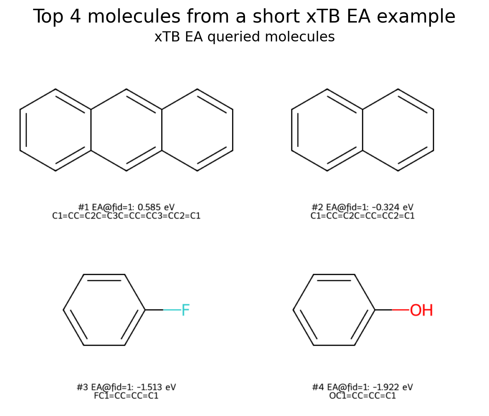

# **Molecule Discovery with SMILES, SELFIES, and xTB**

This tutorial assumes you are already comfortable with the previous tutorials: running experiments from YAML, composing logger overlays, interpreting multi-fidelity budgets, and configuring the GFlowNet sampler. We will focus on what changes when the search space is **molecules** rather than real-valued vectors.

The molecule examples follow the same budget-constrained active-learning loop introduced earlier, but the candidate \(x\) is now a molecular string. The objective is a molecular property such as **electron affinity** (EA) or **ionisation potential** (IP) computed by [xTB](https://xtb-docs.readthedocs.io/en/latest/) (a family of tight-binding quantum-chemistry methods available as the open-source `xtb` program). The sampler can propose either SELFIES or canonical SMILES strings.

!!! note "Reference"
    The molecule workflow mirrors the molecular discovery setting in [Hernandez-Garcia et al., 2023](https://arxiv.org/abs/2306.11715): multi-fidelity active learning over a structured molecular search space, with GFlowNets used to discover diverse high-scoring candidates under a limited oracle budget.

## **The molecule pipeline**

At a high level, the framework models molecules as:

```text
Molecular string (SELFIES or canonical SMILES)
  -> encode with a sequence model or molecular feature extractor
  -> fit a deep-kernel GP surrogate
  -> score candidate molecules with an acquisition function
  -> sample candidates from a pool, SELFIES GFlowNet, or S3-GFN environment
  -> query xTB for IP/EA at the requested fidelity
```

The important distinction from Branin or Hartmann is that the input space is no longer a fixed-dimensional vector space. Each molecule is a discrete structured object represented by a molecular string. The representation-independent DKL surrogate operates on learned latent vectors from either the [`TransformerSequenceEncoder`](../reference/activelearning/surrogate/sequence/transformer_encoder/#activelearning.surrogate.sequence.transformer_encoder.TransformerSequenceEncoder), a frozen Hugging Face encoder such as GP-MoLFormer, or the molecular package's `MiniMolSmilesEncoder`. The oracle evaluates molecular properties using xTB, which can be computationally expensive, hence the need for careful active learning and multi-fidelity strategies.

The repository includes several example molecule configs arranged as an incremental progression. They combine three kinds of building blocks:

- **Sampler — pool file, SELFIES GFlowNet, or S3-GFN.** The [`PoolFileSampler`](../reference/activelearning/sampler/pool_file_sampler/#activelearning.sampler.pool_file_sampler.PoolFileSampler) draws candidate strings from a pre-defined pool. GFlowNet samplers construct strings token by token, while S3-GFN emits canonical SMILES.
- **Surrogate — Deep Kernel Learning (DKL).** Instead of a GP over raw input coordinates, DKL places a GP on *learned* latent representations. [`EncoderKernel`](../reference/activelearning/surrogate/dkl/kernel/#activelearning.surrogate.dkl.kernel.EncoderKernel) wraps the sequence encoder inside a GPyTorch kernel. The two generic surrogate variants are [`ExactDKLSurrogate`](../reference/activelearning/surrogate/dkl/exact/#activelearning.surrogate.dkl.exact.ExactDKLSurrogate) (exact GP, suitable for smaller datasets) and [`VariationalDKLSurrogate`](../reference/activelearning/surrogate/dkl/variational/#activelearning.surrogate.dkl.variational.VariationalDKLSurrogate) (sparse variational GP, scales to larger candidate pools).
- **Acquisition — UCB and MF-MES.** [`UpperConfidenceBound`](../reference/activelearning/acquisition/botorch/botorch_analytic/#activelearning.acquisition.botorch.botorch_analytic.UpperConfidenceBound) (UCB) scores each candidate by its posterior mean plus a confidence-weighted uncertainty bonus — a simple and effective single-fidelity strategy. [`QMultiFidelityMaxValueEntropy`](../reference/activelearning/acquisition/botorch/botorch_multifidelity/#activelearning.acquisition.botorch.botorch_multifidelity.QMultiFidelityMaxValueEntropy) (MF-MES) generalises max-value entropy search to the multi-fidelity setting, scoring candidates by how much information they provide about the optimal high-fidelity value relative to their query cost.

| Config | Sampler | Surrogate | Acquisition | Fidelity setting | Purpose |
|--------|---------|-----------|-------------|------------------|---------|
| `applications/molecules/config/exact.yaml` | Pool file | Exact SELFIES DKL | UCB | pool fidelity `1` only | Stage 1: smallest pool-based baseline |
| `applications/molecules/config/exact_multi_fidelity.yaml` | Pool file | Exact SELFIES DKL | MF-MES + `CostAwareSelector` | pool fidelities `1 / 2 / 3` | Stage 2: same pool setup with multi-fidelity scoring |
| `applications/molecules/config/gflownet_exact.yaml` | SELFIES GFlowNet | Exact SELFIES DKL | UCB | fixed fidelity `1` | Stage 3: swap the pool sampler for a GFlowNet |
| `applications/molecules/config/gflownet_exact_multi_fidelity.yaml` | SELFIES GFlowNet | Exact SELFIES DKL | MF-MES with cost utility | learned fidelity `1 / 2 / 3` | Stage 4: let the GFlowNet learn molecule-fidelity pairs |
| `applications/molecules/config/gflownet_variational_multi_fidelity.yaml` | SELFIES GFlowNet | Variational SELFIES DKL | MF-MES with cost utility | learned fidelity `1 / 2 / 3` | Stage 5: keep the MF GFlowNet and swap in the scalable variational surrogate |
| `applications/molecules/config/s3gfn_exact.yaml` | S3-GFN | Exact GP-MoLFormer SMILES DKL | UCB | fixed fidelity `1` | Canonical SMILES single-fidelity run |
| `applications/molecules/config/s3gfn_exact_multi_fidelity.yaml` | S3-GFN | Exact GP-MoLFormer SMILES DKL | MF-MES | learned fidelity `1 / 2 / 3` | Canonical SMILES multi-fidelity run |
| `applications/molecules/config/s3gfn_minimol_exact.yaml` | S3-GFN | Exact MiniMol SMILES DKL | UCB | fixed fidelity `1` | Canonical SMILES run with frozen graph fingerprints |
| `applications/molecules/config/s3gfn_minimol_variational_multi_fidelity.yaml` | S3-GFN | Variational MiniMol SMILES DKL | MF-MES | learned fidelity `1 / 2 / 3` | GPU-optimized multi-fidelity run with a sparse GP head |
| `applications/molecules/config/s3gfn_minimol_fixed_variational_multi_fidelity.yaml` | S3-GFN | Fixed MiniMol features + variational GP | MF-MES | learned fidelity `1 / 2 / 3` | Sparse GP without a trainable feature projection |

!!! note "Small defaults for fast checks"
    These examples are tuned to be runnable tutorial setups, not fully optimized molecule-discovery runs. The short command overrides below keep the active-learning budget small enough for a quick functional check, and the provided GFlowNet examples also use relatively short training schedules in the exact-surrogate stages so you can verify the full loop quickly. For better learning, increase both the oracle budget so the surrogate sees more observations and the GFlowNet optimization steps so the policy can better approximate reward-proportional sampling.

## **S3-GFN with SMILES**

S3-GFN emits canonical connected SMILES, so it can be paired with any
SMILES-compatible encoder. The sampler and surrogate are independent
components: S3-GFN uses its GP-MoLFormer policy to generate candidates, while
the DKL surrogate uses its configured encoder to represent them.

```sh
uv run activelearning-molecules applications/molecules/config/s3gfn_exact.yaml
uv run activelearning-molecules applications/molecules/config/s3gfn_exact_multi_fidelity.yaml
```

Both configurations require the `activelearning-molecules` distribution and an
`xtb` executable on `PATH`. The sampler and surrogate deliberately repeat the Hugging Face model
identifiers: S3-GFN fine-tunes its policy, while the surrogate keeps a frozen
feature prior. They therefore load separate model instances and require
additional memory.

With a runtime logger enabled, S3-GFN training telemetry is grouped under
`sampler/s3gfn/`. The scalar metrics include online, replay, and contrastive
losses, log-Z, raw reward statistics, generation validity and duplicate rates,
fidelity proportions, and training or generation durations. The corresponding
trajectory figures are `sampler/s3gfn/training_losses`,
`sampler/s3gfn/log_z`, and `sampler/s3gfn/reward/trajectory`.

S3-GFN uses the validated GPU configuration by default: BF16, compilation for
training and final generation, the attention-mask adapter, the compiled frozen
prior scorer, and equal training, replay, and final-generation batch sizes of
64. `generation_batch_size: null` inherits `batch_size`, so the normal config
does not need to repeat that value.

To opt out of compilation and use the eager FP32 path, add one line under the
sampler:

```yaml
sampler:
  performance_mode: eager
```

Advanced users can still set `compile_strategy`, `torch_compile_mode`,
`torch_compile_dynamic`, `attention_mask_adapter`, `compile_prior_scorer`, and
`model_dtype` individually. Explicit low-level values take precedence over the
selected preset. Keep `batch_size` and `replay_batch_size` aligned unless the
workload has been measured on the target GPU; leave `generation_batch_size`
omitted to retain the validated inheritance behavior.

### **Choosing an encoder for DKL**

An encoder maps each raw molecule to features that the GP can model. A common
design for a pretrained or non-differentiable feature extractor is:

```text
canonical SMILES
  -> feature extractor
  -> fixed-width feature vector
  -> trainable projection to latent_dim
  -> GP surrogate
```

The feature extractor can be frozen while the projection is trained jointly
with the GP. If the encoder itself is trainable, its parameters can be updated
through the same path. This keeps the DKL implementation independent of how
the molecular features are produced: a tokenizer-backed sequence model,
fingerprint generator, or another domain-specific encoder can all implement
the same encoder contract.

MiniMol is one example of this pattern. It produces a frozen 512-dimensional
fingerprint for each SMILES, and `MiniMolSmilesEncoder` projects it into the
configured `latent_dim`. The exact and variational examples use the same
encoder with different GP heads:

```sh
uv run activelearning-molecules applications/molecules/config/s3gfn_minimol_exact.yaml
uv run activelearning-molecules applications/molecules/config/s3gfn_minimol_variational_multi_fidelity.yaml
```

The second configuration is multi-fidelity: S3-GFN chooses among fidelity
levels `1`, `2`, and `3`, while the variational surrogate uses MF-MES and
`target_fidelity: 3`. Its `num_inducing` setting controls the number of
inducing points in the sparse GP. To use fine-tuned MiniMol weights, set the
MiniMol-specific `checkpoint_path` option:

```yaml
surrogate:
  encoder:
    type: MiniMolSmilesEncoder
    checkpoint_path: checkpoints/minimol_finetuned.pth
```

The checkpoint must contain either the predictor state dict directly or under
a `state_dict` key, and must use the same MiniMol architecture.

## **What are SELFIES?**

[SELFIES](https://arxiv.org/abs/1905.13741) (**Self-Referencing Embedded Strings**) are a string representation for molecules. Like SMILES, they encode molecular graphs as text. Unlike SMILES, SELFIES provide a hard validity guarantee: *every* sequence of tokens that is valid under the SELFIES grammar decodes to a chemically valid molecular graph. This makes SELFIES particularly useful for generative active learning: the GFlowNet can learn over a constrained token language without constantly producing chemically invalid candidates. The oracle still needs to reject molecules that fail downstream geometry construction or xTB evaluation (see the failure-handling note in [Run the pool-based DKL examples](#2-run-the-pool-based-dkl-examples)), but SELFIES removes the most common source of invalidity at the representation level.

In this framework:

1. A candidate molecule is stored as a SELFIES string such as `[C][=C][O]`.
2. The tokenizer maps each SELFIES token to an integer ID, adds special tokens such as `[CLS]` and `[EOS]`, and pads to a fixed length.
3. The Transformer encoder embeds the token sequence and pools it into one latent molecule vector.
4. The DKL surrogate fits a GP on those latent vectors and provides posterior predictions to the acquisition function.
5. The oracle decodes SELFIES to a molecular graph before constructing a 3-D geometry for xTB.

## **xTB, IP, EA, and fidelities**

[xTB](https://xtb-docs.readthedocs.io/) is a semi-empirical quantum chemistry program. In these examples the oracle uses the [GFN2-xTB](https://pubs.acs.org/doi/10.1021/acs.jctc.8b01176) method. It is much cheaper than high-level quantum chemistry, but still expensive enough that the active-learning loop should spend queries carefully.

The built-in `XTBIPEAOracle` from `activelearning_molecules.oracles.xtb` computes one of two objectives:

| Task | Meaning | Intuition |
|------|---------|-----------|
| `ea` | [Electron affinity](https://en.wikipedia.org/wiki/Electron_affinity) | Energy change when the molecule accepts an electron. |
| `ip` | [Ionisation potential](https://en.wikipedia.org/wiki/Ionization_energy) | Energy required to remove an electron. |

The three xTB fidelities trade cost for accuracy. Each higher fidelity runs more expensive geometry optimization steps before computing the property, producing a more physically accurate result at the cost of more CPU time.

| Fidelity | What happens | Cost in the provided configs |
|----------|--------------|------------------------------|
| `1` | Generate a rough 3-D shape with RDKit/MMFF (a fast empirical force field), then evaluate IP/EA directly on that unoptimised geometry. Cheapest, least accurate. | `1.0` |
| `2` | Take the fidelity-1 starting geometry and relax it with xTB until it reaches a local energy minimum (neutral geometry optimisation), then evaluate IP/EA. More accurate because the geometry is physically relaxed, but costs one extra xTB run. | `3.5` |
| `3` | Optimise both the neutral and the charged (ionic) geometries with xTB, then compute the *adiabatic* IP/EA as the energy difference between the two relaxed states. Most accurate, but requires two xTB geometry optimisations instead of one. | `7.0` |

!!! warning "External dependency"
    The `activelearning-molecules` distribution installs SELFIES and RDKit, but the `xtb` executable must be installed separately and available on your `PATH`. Check this before running a molecule experiment:

    ```sh
    xtb --version
    ```

## **1. Prepare the molecule environment**

Install the optional molecule dependencies. If you also want the molecule grids in Aim, install the Aim extra at the same time:

```sh
uv sync --all-packages --extra aim
```

The pool-based configs read one SELFIES string per line from:

```text
applications/molecules/config/data/molecules.txt
```

You can replace that file with your own pool later. For now, keep the provided pool so the config paths work unchanged.

## **2. Run the pool-based DKL examples**

Start with the single-fidelity exact-DKL pool config and reduce it to a short run that still queries several molecules:

```sh
uv run activelearning-molecules applications/molecules/config/exact.yaml \
  budget.available_budget=5.0 \
  budget.schedule.value=5.0 \
  selector.num_samples=5 \
  sampler.num_samples=50
```

You should see the same round-level fields as in the synthetic tutorials, plus a figure acknowledgement from the console logger:

```text
[Figure] 'oracle/xtb/ea/query_molecules' (not rendered in console)
[Step 1] active_learning/round=1 | active_learning/samples/selected=5 | active_learning/observations/new=5 | active_learning/cost/round=5.0000 | active_learning/cost/cumulative=5.0000 | active_learning/budget/remaining=0.0000 | profiling/...
Done. Rounds: 1 | Total cost: 5.0000
```

The exact numbers depend on which candidate was selected and whether xTB succeeds for that molecule. Invalid molecules or failed xTB calculations are recorded as `NaN` and filtered before surrogate fitting.

!!! note "Handling failures"
    Even though SELFIES guarantees that every token sequence decodes to a *syntactically* valid molecular graph, two downstream failure modes remain:

    - **Invalid molecules.** RDKit can fail to embed certain graphs into a 3-D geometry — for example, molecules with unusual valences or highly strained ring systems that the MMFF force field cannot handle. When conformer generation fails, the oracle records `NaN` for that candidate.
    - **Failed xTB calculations.** xTB can fail if the starting geometry is too distorted for the SCF (self-consistent field) calculation to converge, or if a geometry optimisation diverges. Again, the result is recorded as `NaN`.

    Both failure types are handled automatically: `NaN` labels are filtered out before the surrogate is fitted, so a few failed queries do not break the active-learning loop.

Once you've confirmed the first round completes successfully, run the full single-fidelity exact-DKL config:

```sh
uv run activelearning-molecules applications/molecules/config/exact.yaml
```

Then move to the multi-fidelity pool version, which keeps the exact SELFIES DKL surrogate but exposes the full xTB fidelity ladder and uses MF-MES with cost-aware selection:

```sh
uv run activelearning-molecules applications/molecules/config/exact_multi_fidelity.yaml
```

This second stage is the first place where the active-learning loop has to decide how much accuracy is worth paying for. The acquisition function scores candidates with respect to the target high-fidelity objective, while the [`CostAwareSelector`](../reference/activelearning/selector/cost_aware_selector/#activelearning.selector.cost_aware_selector.CostAwareSelector) divides each score by its query cost so that cheap fidelities are favoured when they carry similar information. In this pool-based setup, the cost penalty is handled entirely by the selector — the acquisition itself has no cost model.

## **3. Log molecule visualizations**

The molecule configs enable xTB query visualizations in the oracle block:

```yaml
oracle:
    type: XTBIPEAOracle
    task: ea
    log_molecule_visualizations: true
    molecule_visualization_limit: 25
```

`log_molecule_visualizations` asks the oracle to render the queried molecules as a 2-D RDKit grid after each oracle call. `molecule_visualization_limit` caps the grid at 25 molecules; if a batch contains more than 25, the displayed molecules are the highest-scoring queried molecules in that batch.

The console logger only acknowledges the figure. To inspect a more informative grid, compose the run with the Aim overlay and keep the short budget large enough to query several molecules:

```sh
uv run activelearning-molecules applications/molecules/config/exact.yaml config/aim_logging.yaml \
  budget.available_budget=5.0 \
  budget.schedule.value=5.0 \
  selector.num_samples=5 \
  sampler.num_samples=50
```

Open Aim:

```sh
uv run aim up
```

In the Aim UI, open the run and inspect **Images**. For EA runs, the image key is `oracle/xtb/ea/query_molecules`; for IP runs, it is `oracle/xtb/ip/query_molecules`. Each panel shows the query index, fidelity, observed score in eV, and the decoded molecule identifier.

The example below was generated from a short fidelity-1 EA run over the bundled SELFIES pool, then ranking the successful xTB evaluations by observed EA and rendering the top four molecules as a 2x2 grid:



!!! tip "Switching the objective"
    To optimise ionisation potential instead of electron affinity, override the task:

    ```sh
    uv run activelearning-molecules applications/molecules/config/exact.yaml \
      oracle.task=ip \
      logger.run_name=molecules-dkl-exact-ip
    ```

## **4. Run the single-fidelity SELFIES GFlowNet sampler**

The single-fidelity GFlowNet molecule configs replace the finite pool sampler with a SELFIES sequence environment. Setting `fidelities: [1]` restricts the GFlowNet to proposing only fidelity-1 candidates — the policy learns to generate promising SELFIES strings, but fidelity selection is removed from the action space entirely:

```yaml
sampler:
    type: GFlowNetSampler
    n_samples: 16
    fidelities: [1]
    conf:
        env:
            _target_: gflownet.envs.sequences.selfies.Selfies
            env_id: selfies
            id: selfies
            max_length: 8
```

Here, the GFlowNet constructs a molecule token by token in the SELFIES environment. The reward is still derived from the active-learning acquisition function, as in the previous GFlowNet tutorial, but the terminal object is now a SELFIES molecule rather than a grid coordinate.

Run a short exact-DKL GFlowNet check:

```sh
uv run activelearning-molecules applications/molecules/config/gflownet_exact.yaml \
  sampler.n_samples=8 \
  selector.num_samples=1 \
  sampler.conf.gflownet.optimizer.n_train_steps=10 \
  budget.schedule.value=1.0 \
  budget.available_budget=1.0
```

For the full small tutorial run, drop the overrides:

```sh
uv run activelearning-molecules applications/molecules/config/gflownet_exact.yaml
```

!!! note "Why keep the single-fidelity GFlowNet config?"
    It is the cheapest molecule GFlowNet example in the repository and is convenient for verifying that the SELFIES environment and GFlowNet training loop run end-to-end before spending budget on multi-fidelity experiments.

## **5. Run the multi-fidelity SELFIES GFlowNet sampler**

The exact multi-fidelity GFlowNet config lets the policy sample both a SELFIES string and a fidelity level:

```yaml
sampler:
    type: GFlowNetSampler
    n_samples: 64
    fidelities: [1, 2, 3]
    fidelity_action: any
    conf:
        env:
            _target_: gflownet.envs.sequences.selfies.Selfies
            env_id: selfies
            id: selfies
            max_length: 8
```

In this setup, the GFlowNet is not limited to a fixed oracle level. It learns a policy over molecule-fidelity pairs, and the MF-MES acquisition rewards candidates that are informative about the target high-fidelity objective while the cost-aware utility discounts unnecessarily expensive queries. That is one of the main reasons GFlowNets are attractive in the multi-fidelity setting: the same policy can discover promising molecule structures and learn when a cheap xTB evaluation is enough versus when it is worth paying for a higher-fidelity query.

There are two multi-fidelity GFlowNet configs. The first uses an exact GP surrogate, which is simpler and faster for smaller datasets. It searches over SELFIES strings up to length 16, generates 64 candidates per GFlowNet round with 100 training steps, selects 8 per round, and has a total budget of 168 (worst-case cost: 8 candidates × fidelity-3 cost of 7.0):

```sh
uv run activelearning-molecules applications/molecules/config/gflownet_exact_multi_fidelity.yaml
```

For a shorter sanity check, reduce the GFlowNet training steps and selected batch size:

```sh
uv run activelearning-molecules applications/molecules/config/gflownet_exact_multi_fidelity.yaml \
  sampler.conf.gflownet.optimizer.n_train_steps=25 \
  selector.num_samples=4 \
  budget.available_budget=28.0 \
  budget.schedule.value=28.0
```

The second config keeps the same multi-fidelity GFlowNet structure but replaces the exact GP with a variational surrogate. It is a substantially larger run: the molecular search space expands to length 64 (`max_length: 64`), the GFlowNet generates 640 candidates per round with 5000 training steps, selects 128 per round, and the total budget is 1260. The variational surrogate introduces an additional `num_inducing` knob controlling the number of inducing points for the sparse GP approximation. Because the reward landscape over a length-64 SELFIES space is much broader, the config also explicitly tunes reward-shaping parameters (`reward_beta`, `reward_rho`, `reward_min`) and uses a larger policy network:

```sh
uv run activelearning-molecules applications/molecules/config/gflownet_variational_multi_fidelity.yaml
```

Start with the exact config to confirm the full MF-GFN loop works, then graduate to the variational config for a more thorough search.

## **Configuration reference**

!!! warning "Breaking configuration changes"
    `max_mol_tokens` now counts every sequence position, including `[CLS]`,
    `[EOS]`, and padding. The example configurations therefore use `66`
    instead of `64`. External configurations must increase this value if they
    need to preserve the previous number of content-token positions.

    The DKL surrogate discriminators were renamed from
    `ExactSelfiesDKLSurrogate` and `VariationalSelfiesDKLSurrogate` to
    `ExactDKLSurrogate` and `VariationalDKLSurrogate`.

The main molecule-specific fields are:

| Field | Meaning |
|-------|---------|
| `surrogate.encoder.max_mol_tokens` | Total sequence positions, including special tokens and padding, for sequence-based encoders that expose this setting. |
| `surrogate.encoder.latent_dim` | Size of the representation passed to the GP after the encoder's projection or feature head. |
| `surrogate.target_fidelity` | Fidelity level used when MF acquisitions project candidates to the target objective. |
| `surrogate.num_inducing` | Number of inducing points for the sparse variational GP in `VariationalDKLSurrogate`. |
| `sampler.candidate_pool_file` | SELFIES pool used by `PoolFileSampler`. |
| `sampler.conf.env._target_` | GFlowNet environment class for generated SELFIES. |
| `sampler.fidelities` | Fidelity levels available to the GFlowNet policy. `[1]` restricts the policy to fidelity 1 only (single-fidelity); `[1, 2, 3]` enables joint molecule-fidelity sampling (multi-fidelity). |
| `sampler.fidelity_action` | Where the fidelity choice appears in the trajectory; `"any"` lets the policy interleave fidelity selection with token actions. |
| `acquisition.type` | `UpperConfidenceBound` in stages 1 and 3, or `QMultiFidelityLowerBoundMaxValueEntropy` in stages 2, 4, and 5. |
| `acquisition.cost_aware_utility` | Cost model baked into the BoTorch multi-fidelity acquisition during `acquisition.update(...)`. In the GFlowNet multi-fidelity configs this makes the sampler reward proxy cost-aware before top-k selection. |
| `oracle.task` | `ea` for electron affinity or `ip` for ionisation potential. The active-learning loop maximises the objective, so IP runs should negate the physical value — set `oracle.task: ip` and the oracle returns `-IP`, which MES then maximises. |
| `oracle.fidelity_costs` | Query costs used by the budget and the cost-aware utility. |
| `oracle.num_conformers` | Global default for the number of RDKit conformers generated before the xTB geometry step. More conformers improve starting-geometry quality at the cost of additional RDKit time. |
| `oracle.per_fidelity_num_conformers` | Per-fidelity override for `oracle.num_conformers`. Useful when higher fidelities warrant a more thorough conformer search. Does not change the definition of the xTB fidelity itself. |
| `oracle.log_molecule_visualizations` | Whether to log RDKit grids of queried molecules. |
| `oracle.molecule_visualization_limit` | Maximum number of molecules shown per logged grid. |

Encoders may expose additional settings for their own feature-extraction
backend. For example, MiniMol supports `batch_size`, `cache_size`, and
`checkpoint_path`; these options are specific to `MiniMolSmilesEncoder`, not
requirements of the DKL API.

!!! warning "Sequence length and oracle cost"
    Increasing `sampler.conf.env.max_length` or `surrogate.encoder.max_mol_tokens` expands the molecular search space quickly. Start with the provided default values, verify that xTB runs successfully, and only then increase sequence length or per-round budget.

## **What comes next**

You now have the same active-learning loop running on structured molecular strings. Natural follow-ups are:

- swap `oracle.task` between `ea` and `ip` and compare the selected molecules in Aim,
- replace `applications/molecules/config/data/molecules.txt` with a domain-specific SELFIES pool,
- increase GFlowNet training steps once the short run works,
- compare the staged examples under the same total budget,
- or adapt the xTB oracle for a different computational chemistry target using the [Oracle extension guide](../extension-guide/oracle.md).
