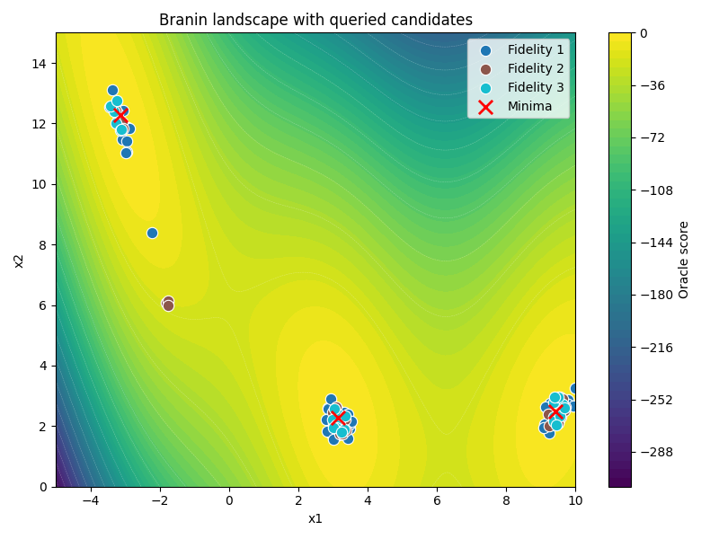

# **Running Experiments**

This tutorial builds on the [Quickstart](../getting-started/quickstart.md). It
shows how to change configuration values from the command line, extend a
single-fidelity experiment to multiple fidelities, compose configuration
files, and monitor a run. If you have not yet completed the Quickstart, do
that first.

## **Override config values**

Append `key=value` arguments after the config path to change fields without
editing the YAML file. Use dot notation for nested fields: for example,
`budget.schedule.value` addresses `value` inside `budget.schedule`. This is
standard [OmegaConf](https://omegaconf.readthedocs.io/) syntax:

```sh
# Change the round budget
uv run activelearning config/branin/multi_fidelity.yaml budget.schedule.value=0.5

# Larger candidate pool per round
uv run activelearning config/branin/multi_fidelity.yaml sampler.num_samples=20000
```

## **Add fidelity levels**

The Quickstart ran `config/branin/single_fidelity.yaml`, which can query the
Branin oracle at only one fidelity. A **fidelity** is a version of the oracle
with a particular cost and degree of approximation: cheap fidelities are
useful for broad exploration, while the highest fidelity represents the
target objective.

`config/branin/multi_fidelity.yaml` uses the same component types and search
space as the single-fidelity config, but makes three fidelity levels available
to the sampler and oracle:

```diff
 oracle:
   type: BraninOracle
   fidelity_costs:
-    1: 1.0
+    1: 0.01
+    2: 0.1
+    3: 1.0

 sampler:
   ...
-  fidelities: [1]
+  fidelities: [1, 2, 3]
```

Run it the same way:

```sh
uv run activelearning config/branin/multi_fidelity.yaml \
  budget.available_budget=3.0
```

```text
[Step 1] active_learning/round=1 | active_learning/samples/proposed=10000 | active_learning/samples/selected=300 | active_learning/observations/new=300 | active_learning/cost/round=3.0000 | active_learning/cost/cumulative=3.0000 | active_learning/budget/remaining=0.0000 | profiling/...
Done. Rounds: 1 | Total cost: 3.0000
```

The first round makes 300 low-fidelity oracle queries instead of 3
high-fidelity queries. At this cold-start stage, all proposed candidates have
the same acquisition score, so
`CostAwareSelector` ranks them by score divided by cost and selects the
cheapest candidates first. Fidelity 1 costs `0.01`, one hundredth of the
single-fidelity query cost, so a budget of `3.0` can pay for 300 such queries.
After the surrogate has been fitted, both predicted utility and cost affect
the ranking, so later rounds need not use only the cheapest fidelity.

For the details of how confidence changes the Branin landscape, see the
[Branin Benchmark](branin_benchmark.md). For a general explanation of how
fidelity, acquisition scores, query costs, and budgets work together, see
[Multi-Fidelity Setting](../concepts/multi_fidelity.md).

Drop the override to run the full experiment:

```sh
uv run activelearning config/branin/multi_fidelity.yaml
```

## **Compose multiple configs**

Pass two or more YAML files to compose them. They are merged from left to
right: later files override shared fields, while fields they do not mention
are inherited:

```sh
uv run activelearning config/branin/multi_fidelity.yaml config/aim_logging.yaml
```

The bundled `config/aim_logging.yaml` changes the logger configuration while
leaving the experiment components inherited from the first file. This overlay
can be composed with any base experiment config.

## **Monitoring and outputs**

The [Quickstart](../getting-started/quickstart.md) introduced the core metrics
printed for each round. You can send those metrics and timing information to
two independent outputs: a logger for live feedback and a run writer for
durable records. Diagnostics can add optional model and component analysis to
either output:

```yaml
logger:
  type: ConsoleLogger
  project_name: activelearning_tutorials

run_writer:
  type: JSONLinesRunWriter
  output_dir: outputs/my_run

diagnostics:
  enabled: true
  figure_interval: 1
  max_points: 1000
```

`logger` submits live scalar metrics and figures to the console or a tracker.
`run_writer` persists `run_manifest.json`, `round_history.jsonl`,
`experiment_log.csv`, `run_summary.json`, and diagnostic figures below
`artifacts/`. `diagnostics` controls optional enrichment for either configured
sink; it does not disable core metrics or profiling. For the full lifecycle and
behavior matrix, see [Monitoring and Diagnostics](../concepts/monitoring_and_diagnostics.md).

### **Live telemetry backends**

The framework supports several logging backends. Install the optional
dependency for the backend you want, then configure its `logger.type`:

| Backend | Install | `logger.type` |
| --- | --- | --- |
| Console | — | [`ConsoleLogger`](../reference/activelearning/logger/logger/#activelearning.logger.logger.ConsoleLogger) |
| [Aim](https://aimstack.io/) | `uv sync --extra aim` | [`AimLogger`](../reference/activelearning/logger/logger/#activelearning.logger.logger.AimLogger) |
| [Weights & Biases](https://wandb.ai/) | `uv sync --extra wandb` | [`WandbLogger`](../reference/activelearning/logger/logger/#activelearning.logger.logger.WandbLogger) |
| [Comet](https://www.comet.com/) | `uv sync --extra comet` | [`CometLogger`](../reference/activelearning/logger/logger/#activelearning.logger.logger.CometLogger) |

You can override `logger.type` directly or provide your own logger overlay.
The repository includes `config/aim_logging.yaml` as a ready-to-use example.

### **Aim walkthrough**

[Aim](https://aimstack.io/) is an open-source experiment tracker that stores
runs locally and provides an interactive UI for inspecting metrics, resolved
configs, and figures.

Install the optional dependency:

```sh
uv sync --extra aim
```

Compose the bundled overlay as a second file after the base config:

```sh
uv run activelearning config/branin/multi_fidelity.yaml config/aim_logging.yaml
```

The overlay uses a `MultiLogger`, so the run still prints to the console and
is also stored in Aim. To log a 2D contour after each batch of Branin queries,
add `oracle.log_landscape=true`:

```sh
uv run activelearning config/branin/multi_fidelity.yaml config/aim_logging.yaml \
  oracle.log_landscape=true
```



Aim stores its data in the `.aim/` directory at the repository root, which is
already ignored by Git. Launch the Aim UI:

```sh
uv run aim up
```

Open the URL shown in the terminal. All runs appear under the
`activelearning_tutorials` project. The most useful views to start with are:

- **Config tab** — the full resolved config that was used for the run
- **Metrics** — scalar time series for `active_learning/cost/round`,
  `active_learning/cost/cumulative`, `active_learning/samples/selected`, and
  `active_learning/budget/remaining`, plus the `profiling/` phase durations
- **Images** — the Branin contour under
  `oracle/branin/query_landscape` and the latest surrogate
  diagnostic under `surrogate/general/predicted_vs_observed`, if enabled

All framework-owned keys use slash-delimited namespaces. GFlowNet metrics and
figures mirrored into the active-learning logger use `sampler/gflownet/`;
their native inner training steps remain available in the upstream GFlowNet
logger. Application packages may reserve their own implementation-specific
namespaces; see the owning application documentation for those keys.

!!! tip "Comparing runs"
    Because all runs log to the same `activelearning_tutorials` project, you
    can compare their resolved configs and cost trajectories in one place.
    Use the logged landscape images to inspect where each run queried; a
    benchmark metric is still needed for a quantitative quality comparison.

### **Configure concerns independently**

Set `logger` to `null` to disable live telemetry while preserving any configured
run-writer output:

```sh
uv run activelearning config/branin/single_fidelity.yaml logger=null
```

Set `run_writer` to `null` to disable durable records while preserving any
configured live telemetry:

```sh
uv run activelearning config/branin/single_fidelity.yaml run_writer=null
```

Set `diagnostics.enabled=false` to omit optional diagnostic metrics and figures
while retaining core metrics and profiling in every configured sink:

```sh
uv run activelearning config/branin/single_fidelity.yaml diagnostics.enabled=false
```

## **Validate a config without running**

To check that a configuration composes and satisfies the framework's schema
without starting an experiment, load it directly:

```python
from activelearning.utils.config_loader import load_and_parse
from activelearning.config import ActiveLearningConfig

load_and_parse(["config/branin/single_fidelity.yaml"], ActiveLearningConfig)
print("config ok")
```

## **Available configs**

`config/branin/` contains the single- and multi-fidelity configs introduced
above, plus the variants used by the
[GFlowNet Sampler](gflownet_sampler.md) tutorial. For a controlled comparison
of five search strategies across five seeds, continue to the
[Branin Benchmark](branin_benchmark.md).
